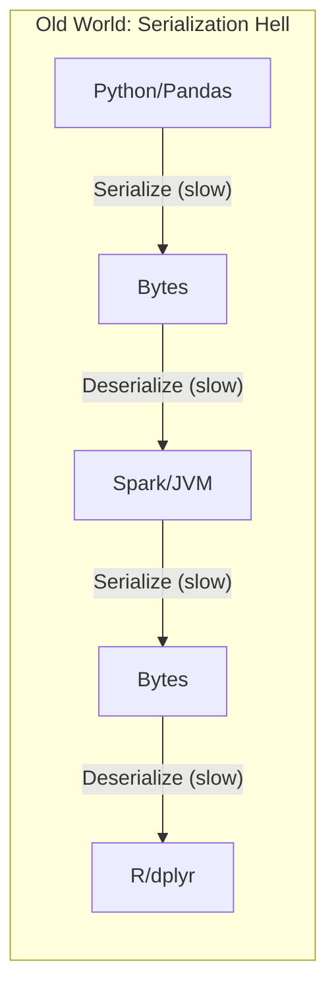
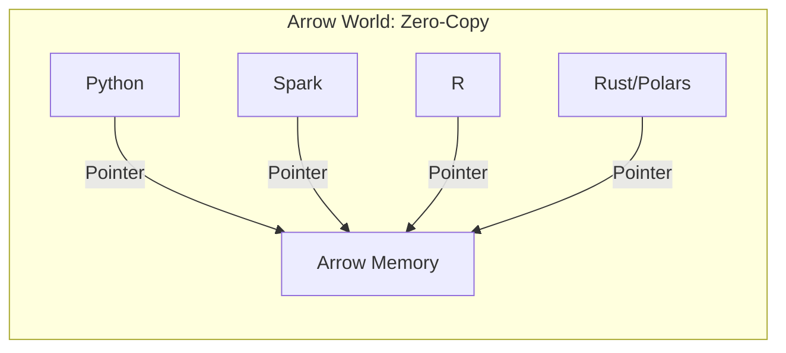
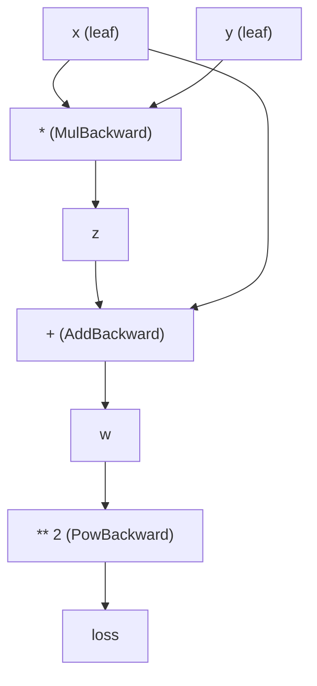
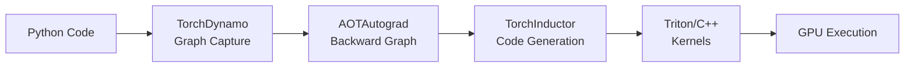
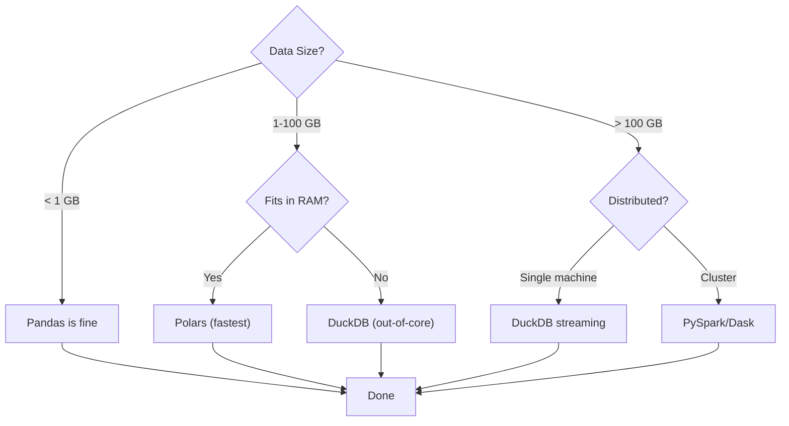

# Machine Learning Libraries Under the Hood: The Definitive Deep Dive

## The Abstraction Trap

Python's dominance in Machine Learning is a paradox. It is an interpreted, dynamically typed, and—let us be honest—slow language, yet it powers the most computationally intensive systems humanity has ever built. GPT-4 was trained using Python. AlphaFold solved protein folding with Python. Every major ML framework, from PyTorch to TensorFlow to JAX, has Python as its primary interface.

This magic is sustained by a delicate layer of abstractions—tools that feel like Python but act like optimized C, C++, Fortran, or Rust underneath. When you write `a + b` on two NumPy arrays, you are not running Python addition. You are dispatching to hand-tuned assembly code that saturates your CPU's vector units. When you call `model.forward()` in PyTorch, you are invoking CUDA kernels written by NVIDIA engineers who spent years optimizing matrix multiplications for specific GPU architectures.

Most practitioners treat these libraries as black boxes. They import `pandas`, call `.groupby()`, and hope the RAM does not overflow. They use `numpy` without understanding why a simple `for` loop can be a thousand times slower than vectorized code. They load data with PyTorch's `DataLoader` without knowing why `num_workers=0` makes their GPU idle 80% of the time.

And for a while, this ignorance works.

Then the dataset grows from gigabytes to terabytes. The training run that took hours now takes weeks. The inference endpoint that handled ten requests per second crumbles under a hundred. The "magic" disappears, replaced by OOM errors, GPU utilization stuck at 3%, and agonizingly slow execution. The abstractions have cracked, and the underlying reality demands attention.

This post strips away the magic. We will explore what actually happens when you run ML code—from the memory layout of NumPy arrays to the query optimization of Polars, from the computational graphs of PyTorch to the JIT compilation of Numba. By the end, you will not just use these libraries; you will understand their architecture and know exactly when to switch tools as your problems scale.

This is the machinery behind the machine learning.

---

## Part I: NumPy—The Foundation of Scientific Python

### 1.1 Why NumPy Exists: The Python Performance Problem

Pure Python is slow. Not "a bit slower than C" slow—orders of magnitude slower. A simple loop that adds two arrays element-by-element in Python involves, for each iteration:

1. Looking up the variable in the namespace dictionary
2. Type checking the objects
3. Dispatching to the appropriate `__add__` method
4. Creating a new Python object for the result
5. Incrementing and decrementing reference counts
6. Checking for exceptions

For a million-element array, you perform these operations a million times. The computational work (adding two numbers) is dwarfed by the interpreter overhead.

```python
import time

# Pure Python - painfully slow
def python_add(a, b):
    result = []
    for i in range(len(a)):
        result.append(a[i] + b[i])
    return result

# NumPy - fast
import numpy as np

def numpy_add(a, b):
    return a + b

# Benchmark
size = 1_000_000
a_list = list(range(size))
b_list = list(range(size))
a_np = np.array(a_list, dtype=np.float64)
b_np = np.array(b_list, dtype=np.float64)

start = time.perf_counter()
python_add(a_list, b_list)
python_time = time.perf_counter() - start

start = time.perf_counter()
numpy_add(a_np, b_np)
numpy_time = time.perf_counter() - start

print(f"Python: {python_time:.4f}s")
print(f"NumPy:  {numpy_time:.4f}s")
print(f"Speedup: {python_time / numpy_time:.0f}x")
# Typical output:
# Python: 0.1847s
# NumPy:  0.0012s
# Speedup: 154x
```

NumPy solves this by moving the loop into C. When you write `a + b` in NumPy, Python dispatches to a compiled C function that:
- Receives pointers to contiguous memory blocks
- Iterates in native C (no interpreter overhead)
- Uses SIMD instructions to process multiple elements per CPU cycle
- Returns control to Python only when done

The Python interpreter is involved exactly once per operation, regardless of array size. This is the fundamental insight behind NumPy's design.

### 1.2 The ndarray: Anatomy of a NumPy Array

A NumPy array is not a Python list. It is a carefully designed data structure consisting of:

1. **Data Buffer**: A contiguous block of raw bytes in memory
2. **dtype**: The data type of each element (float64, int32, etc.)
3. **shape**: A tuple describing dimensions (e.g., (1000, 784))
4. **strides**: Bytes to skip in each dimension to reach the next element
5. **flags**: Properties like contiguity, writeability, alignment

```python
import numpy as np

arr = np.array([[1, 2, 3], [4, 5, 6]], dtype=np.float64)

print(f"Data buffer address: {arr.ctypes.data}")
print(f"dtype: {arr.dtype}")           # float64
print(f"shape: {arr.shape}")           # (2, 3)
print(f"strides: {arr.strides}")       # (24, 8) - bytes!
print(f"itemsize: {arr.itemsize}")     # 8 bytes per float64
print(f"flags:\n{arr.flags}")
```

The **strides** are the key to NumPy's flexibility. They specify how many bytes to skip in memory to move to the next element in each dimension. For a 2D array with shape (2, 3) and dtype float64 (8 bytes):

- Stride for rows: 3 elements × 8 bytes = 24 bytes
- Stride for columns: 1 element × 8 bytes = 8 bytes

This means the memory layout is:

```
Memory: [1.0][2.0][3.0][4.0][5.0][6.0]
         ^   ^   ^   ^   ^   ^
         |   |   |   |   |   |
       [0,0][0,1][0,2][1,0][1,1][1,2]
```

### 1.3 C-Order vs Fortran-Order: Why Layout Matters

Arrays can be stored in two major orders:

**C-Order (Row-Major)**: Consecutive elements of a row are adjacent in memory. This is the default in NumPy, Python, and C.

**Fortran-Order (Column-Major)**: Consecutive elements of a column are adjacent in memory. This is the default in Fortran, MATLAB, and R.

```python
import numpy as np

# C-order (default)
c_arr = np.array([[1, 2, 3], [4, 5, 6]], order='C')
print(f"C-order strides: {c_arr.strides}")  # (24, 8)

# Fortran-order
f_arr = np.array([[1, 2, 3], [4, 5, 6]], order='F')
print(f"F-order strides: {f_arr.strides}")  # (8, 16)

# Memory layout visualization
print(f"C-order memory: {c_arr.ravel('K')}")  # [1 2 3 4 5 6]
print(f"F-order memory: {f_arr.ravel('K')}")  # [1 4 2 5 3 6]
```

Why does this matter? **Cache locality**. Modern CPUs fetch memory in cache lines (typically 64 bytes). When you access sequential memory addresses, the CPU prefetcher loads data efficiently. When you access scattered addresses, you get cache misses.

```python
import numpy as np
import time

size = 10000
arr_c = np.random.rand(size, size).astype(np.float64)
arr_f = np.asfortranarray(arr_c)

# Sum rows (accesses consecutive memory in C-order)
start = time.perf_counter()
for i in range(size):
    np.sum(arr_c[i, :])
c_row_time = time.perf_counter() - start

start = time.perf_counter()
for i in range(size):
    np.sum(arr_f[i, :])
f_row_time = time.perf_counter() - start

print(f"Row sum - C-order: {c_row_time:.4f}s")
print(f"Row sum - F-order: {f_row_time:.4f}s")
print(f"C-order is {f_row_time/c_row_time:.1f}x faster for row access")
# C-order can be 2-5x faster for row-wise operations
```

**The rule**: Process data in the order it is stored. If your array is C-order, iterate over rows. If it is F-order, iterate over columns. Most ML libraries assume C-order.

### 1.4 Views vs Copies: The Memory Efficiency Secret

One of NumPy's most powerful features is the ability to create **views**—new array objects that share the same underlying data buffer.

```python
import numpy as np

original = np.array([1, 2, 3, 4, 5, 6])
view = original[::2]  # Every other element

print(f"original data address: {original.ctypes.data}")
print(f"view data address: {view.ctypes.data}")
# Same address! view shares original's memory

# Modifying view modifies original
view[0] = 999
print(original)  # [999, 2, 3, 4, 5, 6]
```

Operations that create views (zero-copy):
- Slicing: `arr[::2]`, `arr[:100]`, `arr[10:20]`
- Reshape (when possible): `arr.reshape(10, 10)`
- Transpose: `arr.T`
- Ravel (when C-contiguous): `arr.ravel()`

Operations that create copies (allocate new memory):
- Fancy indexing: `arr[[0, 2, 5]]`
- Boolean indexing: `arr[arr > 0]`
- Explicit copy: `arr.copy()`
- Non-contiguous reshape

```python
import numpy as np

arr = np.arange(12).reshape(3, 4)

# View - no memory allocation
transposed = arr.T
print(f"Transpose is view: {np.shares_memory(arr, transposed)}")  # True

# Copy - allocates new memory
fancy_indexed = arr[[0, 2]]
print(f"Fancy index is view: {np.shares_memory(arr, fancy_indexed)}")  # False
```

Understanding when NumPy creates views versus copies is essential for memory-efficient code. A single accidental copy of a 10GB array can crash your system.

### 1.5 SIMD Vectorization: The Speed Secret

Modern CPUs have **SIMD** (Single Instruction, Multiple Data) units that can perform the same operation on multiple values simultaneously. Intel's AVX-512 can process 8 double-precision floats in a single instruction.

NumPy is compiled with optimized BLAS (Basic Linear Algebra Subprograms) libraries—typically OpenBLAS or Intel MKL—that exploit these instructions.

```python
import numpy as np

# Check BLAS configuration
np.__config__.show()
# Shows which BLAS library is linked (openblas, mkl, etc.)
```

The speedup from SIMD is substantial:

| Operation | Scalar (1 element/cycle) | AVX-512 (8 elements/cycle) | Theoretical Speedup |
|-----------|--------------------------|----------------------------|---------------------|
| Addition | 1 | 8 | 8x |
| Multiplication | 1 | 8 | 8x |
| FMA (multiply-add) | 1 | 8 | 8x |

In practice, memory bandwidth often limits the speedup, but for compute-bound operations (matrix multiplication), SIMD provides massive gains.

### 1.6 The Universal Functions (ufuncs)

NumPy's ufuncs are the building blocks of vectorized computation. They are compiled C functions that operate element-wise on arrays.

```python
import numpy as np

# These are all ufuncs
np.add        # Addition
np.multiply   # Multiplication
np.sin        # Sine
np.exp        # Exponential
np.log        # Natural log
np.maximum    # Element-wise maximum

# ufuncs have special methods
arr = np.array([1, 2, 3, 4, 5])

np.add.reduce(arr)       # Sum: 15
np.multiply.reduce(arr)  # Product: 120
np.add.accumulate(arr)   # Running sum: [1, 3, 6, 10, 15]
np.add.outer(arr, arr)   # Outer product: 5x5 matrix
```

You can create custom ufuncs with `np.frompyfunc` or `np.vectorize`, but these are slow—they still call Python for each element. For true performance, you need Numba (covered later).

### 1.7 Broadcasting: Implicit Dimension Expansion

Broadcasting allows operations between arrays of different shapes by automatically expanding dimensions.

```python
import numpy as np

# Scalar broadcast
arr = np.array([1, 2, 3])
result = arr + 10  # [11, 12, 13]

# 1D to 2D broadcast
matrix = np.array([[1, 2, 3], [4, 5, 6]])
row = np.array([10, 20, 30])
result = matrix + row  # Adds row to each row of matrix

# Broadcasting rules:
# 1. Align shapes from the right
# 2. Dimensions match if equal or one is 1
# 3. Size-1 dimensions are stretched

# Shape (3, 4) + Shape (4,) -> Valid (4 matches 4)
# Shape (3, 4) + Shape (3,) -> Invalid! (4 != 3)
# Shape (3, 4) + Shape (3, 1) -> Valid (1 broadcasts to 4)
```

Broadcasting happens without copying data—NumPy uses strides of 0 to "repeat" values virtually:

```python
import numpy as np

arr = np.array([1, 2, 3])
broadcasted = np.broadcast_to(arr, (1000, 3))

print(f"Original size: {arr.nbytes} bytes")
print(f"Broadcasted size: {broadcasted.nbytes} bytes")  # Same! No copy
print(f"Broadcasted strides: {broadcasted.strides}")  # (0, 8) - stride of 0!
```

---

## Part II: Apache Arrow—The Zero-Copy Revolution

### 2.1 The Problem Arrow Solves

Before Arrow, moving data between systems was painful. Pandas stored strings as Python objects scattered across memory. Spark used JVM objects. R used its own internal representation. Every boundary crossing required serialization—converting data to bytes, transmitting, then deserializing.



Arrow defines a **language-independent columnar memory format**. If everyone agrees on how data is laid out in memory, no conversion is needed.



### 2.2 Columnar vs Row-Oriented Storage

Traditional databases (PostgreSQL, MySQL) store data row-by-row:

```
Row-oriented: [id=1, name="Alice", age=30] [id=2, name="Bob", age=25] ...
```

Good for: Retrieving entire records, INSERT/UPDATE operations

Arrow uses columnar storage:

```
Columnar: ids=[1, 2, 3, ...] names=["Alice", "Bob", ...] ages=[30, 25, ...]
```

Good for: Analytics (SELECT AVG(age)), compression, SIMD operations

For ML, columnar format is almost always superior because:

1. **We access columns, not rows**: `df['feature1']` reads one column, not every field
2. **Better compression**: Similar values together compress better
3. **SIMD efficiency**: Operations on columns map directly to vector instructions
4. **Cache efficiency**: Processing a column keeps data in cache

### 2.3 The Arrow Memory Format

An Arrow array consists of:

1. **Validity buffer**: Bitmask indicating null values
2. **Data buffer(s)**: The actual values, contiguously stored
3. **Offset buffer** (for variable-length types): Where each string/list starts

```python
import pyarrow as pa

# Create an Arrow array
arr = pa.array([1, 2, None, 4, 5])

print(f"Type: {arr.type}")
print(f"Null count: {arr.null_count}")
print(f"Buffers: {arr.buffers()}")
# [<pyarrow.Buffer address=... size=1>,   # Validity bitmap
#  <pyarrow.Buffer address=... size=40>]  # Data (8 bytes × 5)
```

For strings, Arrow uses a clever representation:

```python
import pyarrow as pa

strings = pa.array(["hello", "world", "arrow"])

# Three buffers:
# 1. Validity bitmap
# 2. Offsets: [0, 5, 10, 15] - where each string starts
# 3. Data: "helloworldarrow" - all characters concatenated

buffers = strings.buffers()
print(f"Offset buffer: {buffers[1].to_pybytes()}")
print(f"Data buffer: {buffers[2].to_pybytes()}")
```

This representation is vastly more efficient than Python strings (which are separate heap-allocated objects) and enables zero-copy slicing.

### 2.4 Zero-Copy IPC: Sharing Data Across Processes

Arrow's IPC (Inter-Process Communication) format allows different processes to access the same physical memory:

```python
import pyarrow as pa
import pyarrow.ipc as ipc

# Process 1: Create and write data
table = pa.table({'x': [1, 2, 3], 'y': ['a', 'b', 'c']})

# Write to memory-mapped file
with pa.OSFile('data.arrow', 'wb') as f:
    writer = ipc.RecordBatchFileWriter(f, table.schema)
    writer.write_table(table)
    writer.close()

# Process 2: Read without copying
with pa.memory_map('data.arrow', 'r') as source:
    reader = ipc.RecordBatchFileReader(source)
    table2 = reader.read_all()
    
# table2's buffers point to the memory-mapped file
# No deserialization, no memory allocation
```

This is how Spark and Pandas can exchange data efficiently, and how DuckDB can query Parquet files without loading them entirely into RAM.

### 2.5 Arrow Flight: Network Zero-Copy

Arrow Flight extends zero-copy to network transfers. Instead of serializing to JSON or CSV, Flight sends Arrow record batches directly over gRPC.

```python
import pyarrow.flight as flight

# Server streams Arrow batches directly
# Client receives them as Arrow tables
# No serialization/deserialization in between

# Example: Reading from a Flight server
client = flight.connect("grpc://localhost:8815")
reader = client.do_get(flight.Ticket(b"my_dataset"))
table = reader.read_all()
```

For ML pipelines that move data between services, Flight can reduce data transfer overhead by 10-100x compared to JSON APIs.

---

## Part III: Pandas—The Legacy Giant and Its Evolution

### 3.1 The Pandas Memory Problem

Pandas became the workhorse of data science, but it was designed in 2008 when datasets were smaller and memory was the primary constraint to optimize. Its design decisions create challenges at scale.

**The Block Manager**: Internally, Pandas stores a DataFrame as a collection of "blocks"—2D NumPy arrays grouped by dtype. This seems efficient, but:

```python
import pandas as pd
import numpy as np

df = pd.DataFrame({
    'int_col': np.arange(1000000),
    'float_col': np.random.rand(1000000),
    'str_col': ['text'] * 1000000
})

# Check internal blocks
print(df._data)
# BlockManager with separate blocks for int, float, object types
```

Problems arise from:

1. **Consolidation overhead**: Adding columns triggers block reorganization
2. **Object dtype for strings**: Pre-Pandas 2.0, strings were Python objects
3. **Defensive copying**: Most operations copy by default

### 3.2 The String Memory Disaster (Pre-2.0)

Before Pandas 2.0, strings were stored as Python object pointers:

```python
import pandas as pd
import sys

# Old Pandas string storage
df = pd.DataFrame({'text': ['hello'] * 1000000})

# Each row stores a pointer (8 bytes) to a Python string object
# Each Python string object has:
# - PyObject header (~28 bytes)
# - String data
# - Hash cache
# Total: ~50+ bytes per "hello" vs 5 bytes of actual data

print(f"Memory usage: {df.memory_usage(deep=True).sum() / 1e6:.1f} MB")
# Often 10-20x the actual string data size
```

### 3.3 Pandas 2.0: The Arrow Backend Revolution

Pandas 2.0 (released 2023) introduced optional Arrow-backed dtypes:

```python
import pandas as pd

# Enable Arrow strings
df = pd.read_csv('data.csv', dtype_backend='pyarrow')

# Or convert existing DataFrame
df['text'] = df['text'].astype('string[pyarrow]')

# Memory comparison
df_object = pd.DataFrame({'text': ['hello world'] * 1000000})
df_arrow = df_object.astype({'text': 'string[pyarrow]'})

print(f"Object dtype: {df_object.memory_usage(deep=True).sum() / 1e6:.1f} MB")
print(f"Arrow dtype: {df_arrow.memory_usage(deep=True).sum() / 1e6:.1f} MB")
# Arrow is typically 2-5x more memory efficient for strings
```

Performance improvements are also substantial:

```python
import pandas as pd
import time

df = pd.DataFrame({'text': ['hello world example'] * 1000000})

# Object dtype
start = time.perf_counter()
df['text'].str.startswith('hello')
object_time = time.perf_counter() - start

# Arrow dtype
df_arrow = df.astype({'text': 'string[pyarrow]'})
start = time.perf_counter()
df_arrow['text'].str.startswith('hello')
arrow_time = time.perf_counter() - start

print(f"Object dtype: {object_time:.3f}s")
print(f"Arrow dtype: {arrow_time:.3f}s")
print(f"Arrow is {object_time/arrow_time:.1f}x faster")
# Arrow string operations can be 5-10x faster
```

### 3.4 Copy-on-Write: The Future of Pandas

Pandas 2.0 also introduced Copy-on-Write (CoW) mode:

```python
import pandas as pd

pd.options.mode.copy_on_write = True

df = pd.DataFrame({'a': [1, 2, 3]})
df2 = df[['a']]  # Previously might share memory

# With CoW, modifications trigger automatic copying
df2.iloc[0, 0] = 999  # Only now is a copy made
print(df)  # Original unchanged: [1, 2, 3]
```

CoW eliminates the confusing `SettingWithCopyWarning` and reduces memory usage by deferring copies until necessary.

---

## Part IV: Polars—The Modern Replacement

### 4.1 Why Polars Exists

Polars is a DataFrame library written in Rust, designed from scratch for modern hardware and modern data sizes. It makes fundamentally different choices than Pandas:

| Aspect | Pandas | Polars |
|--------|--------|--------|
| Implementation | Python + NumPy | Rust + Arrow |
| Execution | Eager (immediate) | Lazy (optimized) |
| Threading | GIL-limited | Full parallelism |
| Memory | Block manager | Apache Arrow |
| Strings | Object pointers (legacy) | Arrow native |
| Missing values | Various (NaN, None, NaT) | Null (consistent) |

### 4.2 Lazy Evaluation and Query Optimization

Polars' killer feature is lazy evaluation with query optimization:

```python
import polars as pl

# Lazy query - builds a plan, doesn't execute
lazy_df = (
    pl.scan_parquet("huge_dataset/*.parquet")
    .filter(pl.col("year") > 2020)
    .group_by("category")
    .agg([
        pl.col("value").mean().alias("avg_value"),
        pl.col("value").sum().alias("total_value"),
        pl.count().alias("count")
    ])
    .sort("avg_value", descending=True)
    .head(100)
)

# See the optimized plan
print(lazy_df.explain())

# Execute only when needed
result = lazy_df.collect()
```

The optimizer performs:

1. **Predicate pushdown**: Filters pushed to data source (read less data)
2. **Projection pushdown**: Only read needed columns
3. **Common subexpression elimination**: Compute shared values once
4. **Join optimization**: Reorder joins for efficiency

```python
import polars as pl

# Without optimization: reads all columns, all rows, then filters
# With optimization: reads only needed columns, filters during read

lazy_df = (
    pl.scan_parquet("data.parquet")
    .select(["name", "age"])  # Projection pushdown
    .filter(pl.col("age") > 30)  # Predicate pushdown
)

# This reads only 'name' and 'age' columns
# And only rows where age > 30
# All optimized at the Parquet level
```

### 4.3 Parallelism Without the GIL

Pandas operations largely run single-threaded due to Python's GIL. Polars, being Rust, uses all available cores:

```python
import polars as pl
import pandas as pd
import time

# Create test data
n_rows = 10_000_000
data = {
    'a': range(n_rows),
    'b': [f'text_{i % 1000}' for i in range(n_rows)],
    'c': [i * 0.5 for i in range(n_rows)]
}

# Pandas
pdf = pd.DataFrame(data)
start = time.perf_counter()
pdf.groupby('b').agg({'a': 'sum', 'c': 'mean'})
pandas_time = time.perf_counter() - start

# Polars
plf = pl.DataFrame(data)
start = time.perf_counter()
plf.group_by('b').agg([
    pl.col('a').sum(),
    pl.col('c').mean()
])
polars_time = time.perf_counter() - start

print(f"Pandas: {pandas_time:.2f}s")
print(f"Polars: {polars_time:.2f}s")
print(f"Speedup: {pandas_time/polars_time:.1f}x")
# Polars is typically 3-10x faster
```

### 4.4 Expression API: The Polars Philosophy

Polars uses an expression-based API that is composable and optimization-friendly:

```python
import polars as pl

df = pl.DataFrame({
    'name': ['Alice', 'Bob', 'Charlie', 'Diana'],
    'score': [85, 92, 78, 95],
    'subject': ['Math', 'Math', 'Science', 'Science']
})

# Expressions are composable
result = df.select([
    pl.col('name'),
    pl.col('score'),
    
    # Window functions
    pl.col('score').mean().over('subject').alias('subject_avg'),
    
    # Conditional expressions
    pl.when(pl.col('score') > 90)
      .then(pl.lit('A'))
      .when(pl.col('score') > 80)
      .then(pl.lit('B'))
      .otherwise(pl.lit('C'))
      .alias('grade'),
    
    # String operations
    pl.col('name').str.to_uppercase().alias('name_upper')
])

print(result)
```

### 4.5 Streaming for Larger-than-Memory Data

Polars can process datasets larger than RAM using streaming:

```python
import polars as pl

# Process 100GB file with 16GB RAM
result = (
    pl.scan_parquet("huge_file.parquet")
    .filter(pl.col("value") > 100)
    .group_by("category")
    .agg(pl.col("amount").sum())
    .collect(streaming=True)  # Enable streaming
)
```

With streaming, Polars processes data in chunks, never loading the entire dataset into memory.

---

## Part V: DuckDB—SQL for the Modern Data Stack

### 5.1 What DuckDB Is

DuckDB is an in-process analytical database—think "SQLite for analytics." It runs inside your Python process, requires no server, and is optimized for OLAP (Online Analytical Processing) workloads.

```python
import duckdb

# DuckDB runs in-process - no server needed
con = duckdb.connect()

# Query Parquet files directly without loading into RAM
result = con.execute("""
    SELECT 
        category,
        AVG(price) as avg_price,
        SUM(quantity) as total_quantity
    FROM 'sales_*.parquet'
    WHERE date >= '2024-01-01'
    GROUP BY category
    ORDER BY total_quantity DESC
    LIMIT 100
""").fetchdf()
```

### 5.2 Out-of-Core Execution

DuckDB can process datasets larger than available memory by automatically spilling to disk:

```python
import duckdb

# Configure memory limit
con = duckdb.connect()
con.execute("SET memory_limit = '4GB'")
con.execute("SET temp_directory = '/tmp/duckdb'")

# This query can process 50GB of data with 4GB RAM
result = con.execute("""
    SELECT 
        user_id,
        SUM(amount) as total_spent
    FROM 'transactions_*.parquet'
    GROUP BY user_id
    ORDER BY total_spent DESC
""").fetchdf()
```

DuckDB's secret is its vectorized execution engine that processes data in batches, combined with intelligent memory management that spills intermediate results when needed.

### 5.3 DuckDB + Polars + Pandas Integration

DuckDB integrates seamlessly with the Python data ecosystem:

```python
import duckdb
import polars as pl
import pandas as pd

# Query a Pandas DataFrame with SQL
pdf = pd.DataFrame({'a': [1, 2, 3], 'b': ['x', 'y', 'z']})
result = duckdb.query("SELECT * FROM pdf WHERE a > 1").df()

# Query a Polars DataFrame
plf = pl.DataFrame({'a': [1, 2, 3], 'b': ['x', 'y', 'z']})
result = duckdb.query("SELECT * FROM plf WHERE a > 1").pl()

# Convert between all three efficiently (zero-copy where possible)
arrow_table = duckdb.query("SELECT * FROM pdf").arrow()
polars_df = pl.from_arrow(arrow_table)
pandas_df = arrow_table.to_pandas()
```

### 5.4 When to Use What

| Scenario | Best Tool | Why |
|----------|-----------|-----|
| Exploratory data analysis | Polars or Pandas | Interactive, familiar API |
| SQL queries on files | DuckDB | SQL is often clearer for complex analytics |
| Large aggregations | DuckDB or Polars | Out-of-core support, parallelism |
| Feature engineering for ML | Polars | Expressions API, lazy evaluation |
| Legacy codebase | Pandas | Compatibility, ecosystem |
| One-off file queries | DuckDB | No setup, SQL familiarity |

---

## Part VI: PyTorch Internals—The Deep Learning Engine

### 6.1 Tensors vs NumPy Arrays

PyTorch tensors look similar to NumPy arrays but have crucial differences:

```python
import torch
import numpy as np

# NumPy: data only
np_arr = np.array([1, 2, 3])

# PyTorch: data + autograd metadata
torch_tensor = torch.tensor([1.0, 2.0, 3.0], requires_grad=True)

print(f"NumPy dtype: {np_arr.dtype}")
print(f"PyTorch dtype: {torch_tensor.dtype}")
print(f"Requires grad: {torch_tensor.requires_grad}")
print(f"Grad function: {torch_tensor.grad_fn}")  # None for leaf tensors
```

The key difference is that PyTorch tensors can track their computational history for automatic differentiation.

### 6.2 The Computational Graph

When `requires_grad=True`, PyTorch builds a directed acyclic graph (DAG) of operations:

```python
import torch

x = torch.tensor([2.0], requires_grad=True)
y = torch.tensor([3.0], requires_grad=True)

# Each operation creates a node in the graph
z = x * y      # MulBackward0
w = z + x      # AddBackward0
loss = w ** 2  # PowBackward0

print(f"loss.grad_fn: {loss.grad_fn}")
print(f"Next: {loss.grad_fn.next_functions}")
# Shows the graph structure
```

The graph records:
1. Which operation created each tensor
2. Which tensors were inputs to each operation
3. How to compute gradients (the backward function)



### 6.3 Backward Pass: How Gradients Flow

When you call `loss.backward()`, PyTorch:

1. Traverses the graph in reverse topological order
2. Calls each node's backward function
3. Accumulates gradients in `.grad` attributes

```python
import torch

x = torch.tensor([2.0], requires_grad=True)
y = x ** 2  # y = x^2, dy/dx = 2x
z = y * 3   # z = 3y = 3x^2, dz/dx = 6x

z.backward()

print(f"dz/dx: {x.grad}")  # tensor([12.]) = 6 * 2
```

The gradient computation uses the chain rule:
$$\frac{dz}{dx} = \frac{dz}{dy} \cdot \frac{dy}{dx} = 3 \cdot 2x = 6x$$

### 6.4 torch.compile: The JIT Revolution

PyTorch 2.0 introduced `torch.compile`, which JIT-compiles models for significant speedups:

```python
import torch

model = MyModel()

# Compile the model
compiled_model = torch.compile(model)

# First call triggers compilation
output = compiled_model(input_tensor)  # Slower (compiling)
output = compiled_model(input_tensor)  # Fast (compiled)
```

The compilation pipeline:

1. **TorchDynamo**: Captures Python bytecode and extracts the computational graph
2. **AOTAutograd**: Pre-computes backward graph for efficient differentiation
3. **TorchInductor**: Generates optimized Triton or C++ code
4. **Triton**: Compiles to efficient GPU kernels



### 6.5 Kernel Fusion: Why Compilation Matters

Without compilation, each operation launches a separate GPU kernel:

```python
# Without compilation: 4 kernel launches
y = x.sin()      # Kernel 1
y = y.cos()      # Kernel 2
y = y + 1        # Kernel 3
y = y * 2        # Kernel 4
```

Each kernel launch has overhead (~5-10μs), and data must be written to and read from global memory between kernels.

With `torch.compile`, these operations fuse into a single kernel:

```python
@torch.compile
def fused_ops(x):
    y = x.sin()
    y = y.cos()
    y = y + 1
    y = y * 2
    return y

# Single kernel: sin, cos, add, multiply all in one
result = fused_ops(x)
```

The fused kernel:
- Launches once (reduced overhead)
- Keeps intermediate values in registers (no global memory round-trips)
- Can be 2-10x faster for element-wise operations

---

## Part VII: Data Loading—The Hidden Bottleneck

### 7.1 The GPU Starvation Problem

A common scenario: you buy an expensive GPU, start training, and see GPU utilization stuck at 10-20%. The GPU is waiting for data.

```python
import torch
from torch.utils.data import DataLoader

# Bad: GPU starves waiting for data
dataloader = DataLoader(dataset, batch_size=32, num_workers=0)
# num_workers=0 means main thread loads data
# GPU idle while waiting for Python to load/preprocess
```

### 7.2 DataLoader Parameters That Matter

```python
from torch.utils.data import DataLoader

dataloader = DataLoader(
    dataset,
    batch_size=32,
    
    # Parallel data loading
    num_workers=8,  # Spawn 8 worker processes
    
    # Faster CPU-to-GPU transfer
    pin_memory=True,  # Use page-locked memory
    
    # Overlap loading with training
    prefetch_factor=2,  # Each worker loads 2 batches ahead
    
    # Randomization
    shuffle=True,
    
    # Handle incomplete final batch
    drop_last=True,  # Important for BatchNorm
)
```

**num_workers**: Number of parallel processes for data loading. Rule of thumb: start with 4 × number of GPUs, tune based on CPU utilization.

**pin_memory**: Allocates data in page-locked (pinned) memory, enabling asynchronous CPU-to-GPU transfers. Always use when training on GPU.

**prefetch_factor**: Number of batches each worker pre-loads. Higher values smooth out loading variance but use more memory.

### 7.3 Diagnosing Data Loading Bottlenecks

```python
import torch
import time

def benchmark_dataloader(dataloader, num_batches=100):
    """Measure data loading throughput."""
    
    start = time.perf_counter()
    for i, batch in enumerate(dataloader):
        if i >= num_batches:
            break
        # Move to GPU (this is where pin_memory helps)
        if torch.cuda.is_available():
            batch = [b.cuda(non_blocking=True) for b in batch]
    
    elapsed = time.perf_counter() - start
    batches_per_sec = num_batches / elapsed
    samples_per_sec = batches_per_sec * dataloader.batch_size
    
    print(f"Throughput: {samples_per_sec:.0f} samples/sec")
    return samples_per_sec

# Compare different configurations
for num_workers in [0, 2, 4, 8]:
    loader = DataLoader(dataset, batch_size=32, num_workers=num_workers, pin_memory=True)
    print(f"num_workers={num_workers}: ", end="")
    benchmark_dataloader(loader)
```

### 7.4 Memory Mapping for Large Datasets

For datasets too large to fit in RAM, use memory mapping:

```python
import numpy as np
import torch
from torch.utils.data import Dataset

class MemoryMappedDataset(Dataset):
    def __init__(self, path, shape, dtype=np.float32):
        # Memory-map the file - doesn't load into RAM
        self.data = np.memmap(path, dtype=dtype, mode='r', shape=shape)
    
    def __len__(self):
        return len(self.data)
    
    def __getitem__(self, idx):
        # Only loads the requested slice
        return torch.from_numpy(self.data[idx].copy())

# Can "access" 500GB dataset with 16GB RAM
dataset = MemoryMappedDataset('huge_data.bin', shape=(10_000_000, 784))
```

The OS handles loading pages from disk as needed, allowing you to work with datasets much larger than available memory.

---

## Part VIII: Numba—JIT Compilation for Python

### 8.1 When NumPy Isn't Enough

Sometimes your algorithm cannot be expressed as vectorized NumPy operations. You need loops, conditionals, or custom logic. Pure Python loops are slow. Numba solves this.

```python
from numba import njit
import numpy as np
import time

# Pure Python - slow
def python_sum_squares(arr):
    total = 0
    for x in arr:
        total += x * x
    return total

# Numba JIT - fast
@njit
def numba_sum_squares(arr):
    total = 0
    for x in arr:
        total += x * x
    return total

arr = np.random.rand(10_000_000)

# Warm up Numba (first call compiles)
_ = numba_sum_squares(arr)

start = time.perf_counter()
python_sum_squares(arr)
python_time = time.perf_counter() - start

start = time.perf_counter()
numba_sum_squares(arr)
numba_time = time.perf_counter() - start

print(f"Python: {python_time:.3f}s")
print(f"Numba:  {numba_time:.3f}s")
print(f"Speedup: {python_time/numba_time:.0f}x")
# Numba is typically 100-500x faster than pure Python loops
```

### 8.2 How Numba Works

Numba uses LLVM to compile Python bytecode to native machine code:

1. **Type inference**: Numba analyzes function inputs to determine types
2. **IR generation**: Python bytecode is converted to LLVM IR
3. **Optimization**: LLVM applies aggressive optimizations
4. **Code generation**: Machine code is generated for your CPU

```python
from numba import njit

@njit
def add(a, b):
    return a + b

# First call triggers compilation
result = add(1, 2)

# Inspect generated code
print(add.inspect_types())  # Shows inferred types
print(add.inspect_llvm())   # Shows LLVM IR
```

### 8.3 Parallel Loops with prange

Numba can automatically parallelize loops:

```python
from numba import njit, prange
import numpy as np

@njit(parallel=True)
def parallel_sum(arr):
    total = 0
    for i in prange(len(arr)):  # prange = parallel range
        total += arr[i]
    return total

@njit(parallel=True)
def parallel_matrix_multiply(A, B, C):
    """Manual parallel matrix multiplication."""
    M, K = A.shape
    K, N = B.shape
    
    for i in prange(M):  # Parallelize outer loop
        for j in range(N):
            total = 0.0
            for k in range(K):
                total += A[i, k] * B[k, j]
            C[i, j] = total
    return C
```

### 8.4 GPU Acceleration with Numba CUDA

Numba can compile Python functions to CUDA kernels:

```python
from numba import cuda
import numpy as np

@cuda.jit
def vector_add_kernel(a, b, c):
    """CUDA kernel for vector addition."""
    idx = cuda.grid(1)  # Get global thread index
    if idx < a.size:
        c[idx] = a[idx] + b[idx]

# Prepare data
n = 1_000_000
a = np.random.rand(n).astype(np.float32)
b = np.random.rand(n).astype(np.float32)
c = np.zeros(n, dtype=np.float32)

# Copy to GPU
d_a = cuda.to_device(a)
d_b = cuda.to_device(b)
d_c = cuda.to_device(c)

# Launch kernel
threads_per_block = 256
blocks_per_grid = (n + threads_per_block - 1) // threads_per_block
vector_add_kernel[blocks_per_grid, threads_per_block](d_a, d_b, d_c)

# Copy result back
result = d_c.copy_to_host()
```

### 8.5 Numba Limitations

Numba works best for:
- Numerical code with simple types (int, float, arrays)
- Tight loops that cannot be vectorized
- Code that benefits from parallelization

Numba struggles with:
- Python objects (lists, dicts, custom classes)
- String operations
- Dynamic typing
- External library calls

```python
# This works
@njit
def good_numba(arr):
    return arr.sum()

# This fails - can't compile pandas
@njit
def bad_numba(df):
    return df.groupby('a').sum()  # Error!
```

---

## Part IX: The Expert's Decision Framework

### 9.1 Choosing the Right Tool



### 9.2 The Scaling Ladder

| Data Size | RAM Needed | Recommended Tool | Notes |
|-----------|------------|------------------|-------|
| < 100 MB | Any | Pandas | Simplicity wins |
| 100 MB - 1 GB | 4 GB | Pandas or Polars | Polars faster |
| 1 - 10 GB | 16-32 GB | Polars | Lazy evaluation shines |
| 10 - 100 GB | 32-128 GB | Polars or DuckDB | Choose based on workflow |
| 100 GB - 1 TB | Any | DuckDB | Out-of-core execution |
| > 1 TB | Cluster | PySpark | Distributed computing |

### 9.3 Performance Optimization Checklist

**Before writing code:**
- [ ] Estimate data size and memory requirements
- [ ] Choose appropriate tool for scale
- [ ] Design data layout for access patterns (row vs column)

**NumPy optimization:**
- [ ] Use appropriate dtypes (float32 vs float64)
- [ ] Avoid unnecessary copies
- [ ] Use views where possible
- [ ] Ensure contiguous memory for operations
- [ ] Use broadcasting instead of loops

**Pandas optimization:**
- [ ] Use categorical dtype for low-cardinality strings
- [ ] Use Arrow backend for strings (Pandas 2.0+)
- [ ] Avoid iterating rows
- [ ] Use vectorized operations
- [ ] Consider Polars for large data

**PyTorch optimization:**
- [ ] Use appropriate batch size
- [ ] Enable pin_memory for DataLoader
- [ ] Use multiple workers for data loading
- [ ] Use torch.compile for inference
- [ ] Profile with torch.profiler

**General:**
- [ ] Profile before optimizing
- [ ] Optimize the bottleneck, not everything
- [ ] Measure after each change

---

## Quick Reference: Library Comparison

| Feature | NumPy | Pandas | Polars | DuckDB |
|---------|-------|--------|--------|--------|
| **Primary Use** | Numerical computing | Data manipulation | Data manipulation | SQL analytics |
| **Language** | C/Fortran | Python/C | Rust | C++ |
| **Memory Layout** | Contiguous arrays | Block manager | Apache Arrow | Apache Arrow |
| **Parallelism** | Some (BLAS) | Limited | Full | Full |
| **Lazy Evaluation** | No | No | Yes | Yes (via SQL) |
| **Out-of-Core** | Manual | No | Streaming | Yes |
| **SQL Support** | No | No | Yes (SQLContext) | Native |

---

## Conclusion

We have journeyed from the raw bytes of NumPy arrays to the query optimization of Polars, from the computational graphs of PyTorch to the JIT compilation of Numba. The abstractions that make Python usable for ML are not magic—they are carefully engineered systems that trade Python's flexibility for C's speed at precisely the right moments.

The key insights:

1. **Understand your memory layout**. C-order vs Fortran-order, views vs copies, contiguous vs strided—these details determine whether your code runs fast or crawls.

2. **Choose tools for your scale**. Pandas for exploration, Polars for production, DuckDB for analytics, Spark for cluster scale. The right tool at each stage saves hours of optimization.

3. **The GIL is not your enemy**. NumPy, Polars, and PyTorch all release it. Your parallel code is limited only by your understanding of where computation actually happens.

4. **Profile before optimizing**. Intuition about bottlenecks is usually wrong. Measure, then optimize the actual slow part.

5. **Compilation is the future**. torch.compile, Numba, Polars' query optimizer—the trend is clear. Write readable code, let the compiler make it fast.

Python is merely the interface. The machine is where the work happens. Respect the machine, understand its memory, and choose your abstractions wisely.

Build something that scales.

---

## References and Further Reading

- [NumPy Internals Documentation](https://numpy.org/doc/stable/reference/internals.html) — How arrays really work
- [Apache Arrow Specification](https://arrow.apache.org/docs/format/Columnar.html) — The columnar format standard
- [Polars User Guide](https://docs.pola.rs/user-guide/) — Modern DataFrame library
- [DuckDB Documentation](https://duckdb.org/docs/) — In-process analytical database
- [PyTorch Internals Blog](https://pytorch.org/blog/computational-graphs-constructed-in-pytorch/) — How autograd works
- [torch.compile Deep Dive](https://pytorch.org/docs/stable/torch.compiler.html) — JIT compilation in PyTorch 2.0
- [Numba Documentation](https://numba.readthedocs.io/) — JIT compilation for Python
- [High Performance Python](https://www.oreilly.com/library/view/high-performance-python/9781492055013/) by Micha Gorelick and Ian Ozsvald
- [Fluent Python](https://www.oreilly.com/library/view/fluent-python-2nd/9781492056348/) by Luciano Ramalho
