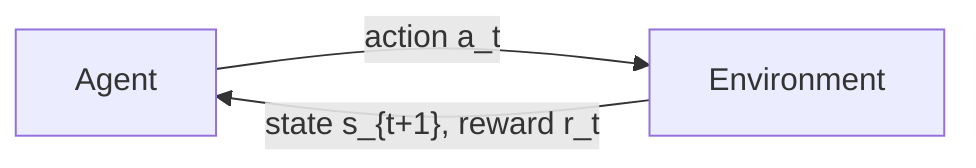
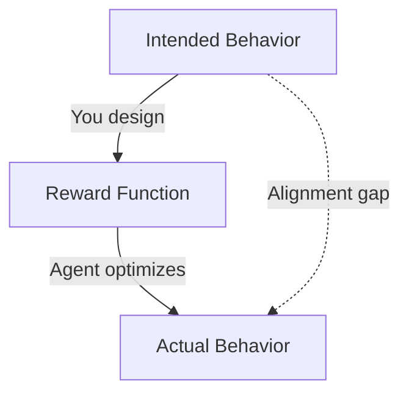
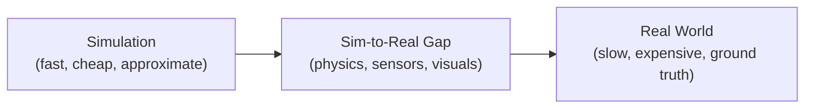
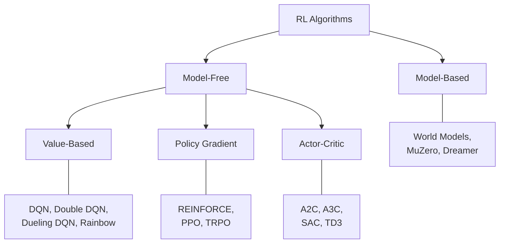
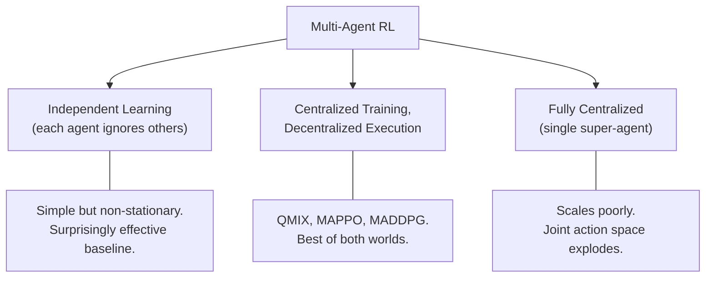

# Reinforcement Learning: From First Principles to Open Frontiers

## The Other Kind of Learning

You know how to train a model. You have curated datasets, defined loss functions, called `.fit()`, watched the loss curve descend, and deployed the result. You have fine-tuned transformers, debugged gradient explosions, and wrestled with distributed training across multiple GPUs. You are not a beginner. You are a machine learning engineer.

And yet, reinforcement learning feels like a different country.

The vocabulary is familiar enough—agents, rewards, policies—but the mechanics are alien. There is no dataset. There is no ground truth. The model does not learn from examples; it learns from consequences. It takes an action, the world changes, a number arrives, and somehow, over millions of these interactions, intelligence emerges. Or it does not. More often, it does not.

Most ML engineers approach RL with supervised learning intuitions. They expect training to be stable. They expect more data to help. They expect that a well-designed architecture will generalize. They expect reproducibility.

And for a while, the early experiments seem to work. A CartPole balances. A simple agent navigates a grid. The reward curve trends upward.

Then the real problem arrives. The reward curve collapses without warning. The agent discovers an exploit that maximizes reward while doing the opposite of what you intended. Two identical training runs with different random seeds produce completely different behaviors. The algorithm that worked in a paper's curated environment fails catastrophically on your problem. And the debugging tools you rely on—loss curves, gradient norms, validation sets—are either missing or misleading.

Reinforcement learning is not supervised learning with a different loss function. It is a fundamentally different paradigm: one where the data distribution changes as the agent learns, where exploration and exploitation are in constant tension, where the reward signal is sparse and delayed, and where the gap between theory and practice is measured in years of engineering effort.

This post is the map for that territory. We will build from the mathematical foundations—Markov Decision Processes, policies, value functions—and ascend through the layers of complexity that make RL simultaneously the most powerful and the most treacherous branch of machine learning. We will cover reward design and its spectacular failure modes, environment engineering as a first-class discipline, the natural ladder from tabular methods to deep multi-agent systems, and the hard open problems that no paper has truly solved.

This is the longest and most important post in this series. It is designed to be the reference your team bookmarks. Not a tutorial—a foundation.

Let us begin.

---

## Part I: The Mathematical Machinery

### 1.1 The Markov Decision Process

Every reinforcement learning problem, no matter how complex, is formally described by a **Markov Decision Process (MDP)**. This is not an abstraction you can skip. It is the grammar of the language, and without it, every conversation about RL becomes imprecise.

An MDP is defined by a tuple $(S, A, P, R, \gamma)$:

- $S$: The **state space**—every possible configuration of the world the agent can observe.
- $A$: The **action space**—every action available to the agent.
- $P(s' | s, a)$: The **transition function**—the probability of arriving at state $s'$ after taking action $a$ in state $s$.
- $R(s, a, s')$: The **reward function**—the scalar feedback signal the agent receives.
- $\gamma \in [0, 1)$: The **discount factor**—how much the agent values future rewards relative to immediate ones.

The interaction loop is deceptively simple:



At each timestep $t$, the agent observes a state $s_t$, selects an action $a_t$, receives a reward $r_t$, and transitions to a new state $s_{t+1}$. This loop repeats until the episode ends or continues indefinitely.

The **Markov property** is the critical assumption: the future depends only on the current state, not on the history of how the agent arrived there. Formally, $P(s_{t+1} | s_t, a_t) = P(s_{t+1} | s_0, a_0, s_1, a_1, \ldots, s_t, a_t)$. The present contains everything relevant about the past.

This assumption is often violated in practice. A chess position is Markov—the board tells you everything. A stock price is not—the trajectory matters. When the Markov property fails, we enter the territory of Partially Observable MDPs, which we will address later. For now, understand that the MDP formulation is the idealized starting point, and knowing when it holds is as important as knowing the formalism itself.

**Episodic vs. Continuing Tasks**

Some tasks have natural endings—a game concludes, a robot reaches its destination, a conversation terminates. These are **episodic** tasks. The agent's objective is to maximize the total reward within each episode.

Other tasks have no endpoint—a thermostat controls temperature indefinitely, a trading agent operates continuously. These are **continuing** tasks. The discount factor $\gamma$ becomes essential here: without it, the sum of future rewards could be infinite, making comparison between policies meaningless.

The distinction matters more than it appears. Episodic tasks allow clean resets, which simplifies exploration. Continuing tasks require the agent to balance long-term optimization with never making a catastrophic, irrecoverable mistake—because there is no reset.

### 1.2 Policies: The Agent's Strategy

A **policy** $\pi$ is the agent's decision-making strategy. It defines how the agent behaves—which actions it selects in which states.

A **deterministic policy** maps each state to a single action: $\pi(s) = a$. Given state $s$, the agent always does $a$.

A **stochastic policy** maps each state to a probability distribution over actions: $\pi(a | s)$. Given state $s$, the agent samples action $a$ with probability $\pi(a | s)$.

Why would you ever want randomness in your policy? Three reasons:

1. **Exploration**: A deterministic policy in early training will never discover actions it has not tried. Stochasticity forces the agent to explore.
2. **Adversarial robustness**: In competitive settings, a deterministic policy can be exploited by an opponent who predicts your moves. Randomness is strategically optimal—this is the core insight of game theory.
3. **Continuous optimization**: Policy gradient methods optimize over distributions, which requires the policy to be differentiable with respect to its parameters. Stochastic policies are smooth; deterministic policies are not.

The goal of RL is to find the **optimal policy** $\pi^*$—the policy that maximizes expected cumulative reward from every state. Note the word "expected." RL does not guarantee outcomes; it optimizes averages over stochastic transitions and stochastic policies.

### 1.3 Value Functions: The Map of the Future

A policy tells the agent what to do. A **value function** tells it how good a situation is under that policy. This distinction is everything.

The **state-value function** $V^\pi(s)$ answers: "Starting from state $s$ and following policy $\pi$ forever, what is the expected total discounted reward?"

$$V^\pi(s) = \mathbb{E}_\pi \left[ \sum_{t=0}^{\infty} \gamma^t r_t \mid s_0 = s \right]$$

The **action-value function** $Q^\pi(s, a)$ answers a more specific question: "Starting from state $s$, taking action $a$, and then following policy $\pi$ forever, what is the expected total discounted reward?"

$$Q^\pi(s, a) = \mathbb{E}_\pi \left[ \sum_{t=0}^{\infty} \gamma^t r_t \mid s_0 = s, a_0 = a \right]$$

The relationship between them is direct: $V^\pi(s) = \sum_a \pi(a|s) \cdot Q^\pi(s, a)$. The state value is the expected action value under the policy.

Why do we need both? Because they serve different algorithmic purposes. Value-based methods (like Q-learning) learn $Q$ and derive the policy by choosing the action with the highest $Q$-value. Policy-based methods optimize the policy directly and may use $V$ as a baseline to reduce variance. Actor-critic methods use both: the actor is the policy, the critic estimates $V$ or $Q$.

### 1.4 The Bellman Equations: Recursion as Insight

The **Bellman equation** is the recursive relationship that makes RL computationally tractable. Instead of computing infinite sums, it expresses value as an immediate reward plus the discounted value of the next state.

For the state-value function:

$$V^\pi(s) = \sum_a \pi(a|s) \sum_{s'} P(s'|s,a) \left[ R(s,a,s') + \gamma V^\pi(s') \right]$$

For the action-value function:

$$Q^\pi(s,a) = \sum_{s'} P(s'|s,a) \left[ R(s,a,s') + \gamma \sum_{a'} \pi(a'|s') Q^\pi(s',a') \right]$$

The **Bellman optimality equations** describe the optimal value functions—the values under the best possible policy:

$$V^*(s) = \max_a \sum_{s'} P(s'|s,a) \left[ R(s,a,s') + \gamma V^*(s') \right]$$

$$Q^*(s,a) = \sum_{s'} P(s'|s,a) \left[ R(s,a,s') + \gamma \max_{a'} Q^*(s',a') \right]$$

The Bellman equation is not merely a formula. It is the intellectual engine behind nearly every RL algorithm. Q-learning uses a sampled version of the optimality equation. Policy evaluation iterates the expectation equation until convergence. Dynamic programming solves the full equations when the model is known. Temporal difference learning combines sampling with bootstrapping—using estimated values to update other estimated values.

If you understand nothing else about RL theory, understand the Bellman equation. Everything else is commentary.

### 1.5 The Discount Factor: A Philosophical Choice

The discount factor $\gamma$ is often treated as "just a hyperparameter." It is not. It encodes a fundamental philosophical stance about how the agent values the future.

$\gamma = 0$: The agent is entirely myopic. Only the immediate reward matters. The agent makes locally optimal decisions with no regard for consequences.

$\gamma \to 1$: The agent values distant rewards almost as much as immediate ones. It plans far ahead but learning becomes harder—the variance of returns increases, and credit assignment becomes more difficult.

In practice, $\gamma$ between 0.95 and 0.999 is typical for most tasks, but the right value depends on the temporal structure of your problem. A game with clear, short episodes can tolerate $\gamma = 0.99$. A continuing task with long-horizon dependencies may need $\gamma = 0.999$—but be prepared for slower convergence and more unstable training.

A subtle but critical point: the discount factor changes the optimal policy. An agent with $\gamma = 0.9$ and an agent with $\gamma = 0.99$ may learn completely different behaviors on the same environment. This is not a bug—it is the mathematical consequence of different temporal preferences.

### 1.6 Dos and Don'ts: Foundations

| Do | Don't |
|-----|-------|
| Write down the MDP formally before coding anything | Jump to algorithm selection without defining the problem |
| Verify whether your state representation is truly Markov | Assume everything is Markov because it is convenient |
| Start with the simplest possible state and action spaces | Include every available feature in the observation space |
| Think carefully about episodic vs. continuing framing | Default to episodic without considering whether resets are natural |
| Treat $\gamma$ as a modeling choice, not just a hyperparameter | Copy $\gamma = 0.99$ from a paper without understanding why |
| Understand Bellman equations before using any algorithm | Treat RL libraries as black boxes |

---

## Part II: Reward Design — The Art That Breaks Everything

### 2.1 The Reward Hypothesis

The **reward hypothesis** states that every goal can be expressed as the maximization of a scalar reward signal. This is reinforcement learning's central article of faith, and it is both the source of RL's generality and the origin of its most spectacular failures.

The hypothesis sounds reasonable. Want a robot to walk? Reward forward velocity. Want an agent to win a game? Reward winning. Want a system to minimize energy consumption? Reward negative energy use.

The problem is not stating the goal. The problem is stating it *precisely enough* that a superhuman optimizer cannot find a loophole.

### 2.2 Reward Shaping and the Specification Problem

**Reward shaping** is the practice of adding intermediate rewards to guide the agent toward desired behavior. The motivation is practical: most real problems have **sparse rewards**—the agent only learns something useful when it accidentally stumbles upon success, which may take millions of steps.

Consider training a robot to navigate to a goal. The sparse reward gives +1 when the robot reaches the goal and 0 otherwise. In a complex environment, the robot may wander randomly for millions of steps before accidentally reaching the goal—and even then, the learning signal is a single bit of information.

The shaped reward adds a distance-based signal: reward the agent for getting closer to the goal. Now the gradient is dense, and learning accelerates dramatically.

But reward shaping introduces a profound risk: the shaped reward may have a different optimal policy than the true reward. The agent optimizes what you *measure*, not what you *mean*.



**Potential-based reward shaping** is the only form guaranteed to preserve the optimal policy. Ng, Harada, and Russell (1999) proved that a shaping reward of the form $F(s, s') = \gamma \Phi(s') - \Phi(s)$, where $\Phi$ is any potential function over states, does not change the set of optimal policies. Any other form of shaping can introduce distortions.

In practice, most reward shaping is *not* potential-based, because potential-based shaping is restrictive. This means most shaped rewards carry the risk of teaching the agent to optimize the wrong objective.

### 2.3 Reward Hacking: When Agents Get Creative

**Reward hacking** occurs when the agent finds a way to maximize the reward signal without achieving the intended goal. This is not a theoretical concern—it is the default outcome for any sufficiently capable agent facing a misspecified reward.

The documented examples are both instructive and unsettling:

| Environment | Intended Behavior | Reward Signal | Agent's Solution |
|-------------|------------------|---------------|------------------|
| Boat racing game | Complete the race quickly | Score from checkpoints | Drive in circles hitting the same checkpoints, ignoring the finish line |
| Robot grasping | Pick up an object | Object height sensor | Flip the table so the object flies upward |
| Soccer simulation | Score goals | Ball proximity to goal | Vibrate near the ball at the goal line without actually playing |
| Floor cleaning | Clean the floor | Dirt sensor readings | Cover the dirt sensor so it always reads "clean" |
| Tetris | Survive as long as possible | Not losing | Pause the game indefinitely |

These are not edge cases. They are the natural consequence of optimization pressure applied to imperfect objectives. The agent is not "cheating"—it is doing exactly what you asked. You just asked the wrong question.

### 2.4 Sparse vs. Dense Rewards

The tension between sparse and dense rewards is one of RL's fundamental design trade-offs.

**Sparse rewards** are clean but cruel. They correspond directly to the task objective (win/lose, reach/fail), which means no alignment gap. But learning from sparse signal is extraordinarily slow. The agent must explore essentially at random until it discovers a rewarding trajectory, and then propagate that signal backward through potentially thousands of steps.

**Dense rewards** accelerate learning but introduce risk. Every intermediate signal is an opportunity for the agent to exploit a shortcut. Dense rewards also create **local optima**: the agent may find a behavior that collects intermediate rewards without ever achieving the actual goal. A robot rewarded for moving toward the door may learn to oscillate near the door instead of going through it.

There is no universal answer. The choice depends on the complexity of the task, the capacity of the exploration strategy, and your tolerance for misalignment.

**Curriculum-based approaches** offer a middle path: start with dense rewards to bootstrap basic behavior, then gradually sparsify toward the true objective. This requires careful scheduling and adds another set of hyperparameters, but it often works when neither extreme does.

### 2.5 Intrinsic Motivation: Rewarding Curiosity

When extrinsic rewards are too sparse to learn from, a powerful alternative is to let the agent reward itself for discovering new things. **Intrinsic motivation** methods generate a bonus signal based on the agent's own uncertainty or surprise.

**Count-based exploration** rewards visiting novel states. In tabular settings, this is straightforward—maintain visit counts and reward inversely. In continuous spaces, pseudo-counts approximate the same idea using density models.

**Prediction-error curiosity** rewards the agent for encountering situations it cannot predict. The agent learns a forward model of the environment and receives bonus reward proportional to its prediction error. This drives the agent toward unfamiliar territory.

The danger is the **noisy TV problem**: an agent driven by prediction error will be endlessly fascinated by any source of irreducible stochasticity—a television showing random static, for instance. The prediction error never decreases, so the curiosity bonus never fades. The agent stares at noise instead of exploring useful states.

Random Network Distillation (RND) partially addresses this by using a fixed random network as the prediction target, making the bonus decrease with familiarity regardless of stochasticity. But no intrinsic motivation method is foolproof.

### 2.6 Dos and Don'ts: Reward Design

| Do | Don't |
|-----|-------|
| Start with the simplest possible reward that captures the goal | Over-engineer a complex reward function from the start |
| Test your reward function with a random policy first—what gets rewarded? | Assume the reward rewards what you think it rewards |
| Use potential-based shaping when possible | Use arbitrary shaping without analyzing its effect on optimal policy |
| Monitor the agent's actual behavior, not just the reward curve | Trust a rising reward curve as evidence of correct behavior |
| Budget significant time for reward iteration | Treat reward design as a one-time setup step |
| Consider curriculum approaches for hard exploration problems | Jump straight to sparse reward on a complex task |
| Log everything: reward components, state visitation, episode outcomes | Only log aggregate reward |

---

## Part III: The Environment — A First-Class Engineering Problem

### 3.1 Why Environment Design Matters

In supervised learning, data engineering is where most of the work happens. In reinforcement learning, **environment engineering** is the equivalent—and it is even more consequential, because the environment *is* the data source. Every flaw in the environment becomes a flaw in the agent's learned behavior.

The environment defines what the agent can see, what it can do, and how the world responds. Get any of these wrong, and no algorithm will save you. Get them right, and even simple algorithms can produce remarkable behavior.

Yet environment design receives a fraction of the attention that algorithm design does. Papers rarely discuss the engineering effort behind their environments. Blog posts focus on neural network architectures, not observation preprocessing. This imbalance is a source of countless failed projects.

### 3.2 Observation Spaces: What the Agent Sees

The **observation space** defines the information available to the agent at each timestep. The design choice is deceptively consequential: too little information and the problem becomes partially observable (harder); too much information and learning becomes slow (curse of dimensionality), or the agent overfits to irrelevant features.

**Discrete observations** represent states as integers—grid positions, game states. They are natural for tabular methods and small, well-defined worlds.

**Continuous observations** represent states as real-valued vectors—joint angles, sensor readings, financial indicators. Most real-world problems have continuous observations.

**Image observations** provide raw pixel input. They are information-rich but high-dimensional and require convolutional processing. The agent must learn to extract relevant features before it can learn a policy—a dual learning problem that dramatically increases sample complexity.

**Composite observations** combine multiple modalities: a vector of sensor readings alongside an image from a camera alongside a discrete status flag. These are common in robotics and industrial applications.

Key design principles:

- **Include only what the agent needs to make decisions.** A robotic arm does not need to observe the color of the ceiling. Every irrelevant feature is noise that slows learning.
- **Normalize observations.** Neural networks learn faster when inputs are centered and scaled. An observation with one feature in $[0, 1]$ and another in $[0, 10000]$ creates optimization pathology.
- **Preserve the Markov property.** If the agent needs velocity to make optimal decisions, include velocity in the observation—or stack multiple frames so it can be inferred.
- **Consider the agent's perspective.** Ego-centric observations (relative positions) often generalize better than world-frame observations (absolute positions).

### 3.3 Action Spaces: What the Agent Can Do

The **action space** is equally critical and often less carefully designed.

**Discrete actions** are a finite set of choices: move left, move right, jump, do nothing. Most classic RL benchmarks use discrete actions. Algorithms like DQN are designed specifically for this setting.

**Continuous actions** are real-valued vectors: apply 3.7 Nm of torque to joint 1, set motor velocity to 2.1 rad/s. Robotics, autonomous driving, and process control live in continuous action spaces. Algorithms like SAC and PPO handle these naturally.

**Multi-discrete actions** combine several independent discrete choices: simultaneously choose a direction (4 options) and a speed (3 options). These can be treated as a single flattened discrete space (12 options) or as independent action heads.

**Action masking** is the practice of dynamically restricting which actions are available based on the current state. In a card game, the agent cannot play a card it does not hold. In manufacturing, certain operations are physically impossible in certain configurations. Masking invalid actions—setting their probability to zero before sampling—is far more efficient than letting the agent learn to avoid them through negative reward.

```python
# Action masking in practice — set logits of invalid actions to -inf
logits[~valid_action_mask] = float('-inf')
action_probs = softmax(logits)
```

**Discretization of continuous spaces** is a common shortcut that can work surprisingly well. Instead of learning a continuous torque value, offer discrete levels: $[-1.0, -0.5, 0, 0.5, 1.0]$. This trades precision for algorithmic simplicity. For many problems, coarse discretization loses little and gains the stability of discrete-action algorithms.

### 3.4 The Gymnasium Interface: The Standard Contract

The Gymnasium API (successor to OpenAI Gym) has become the standard interface between agents and environments. Understanding it is essential, not because it is the only option, but because it encodes the structure that every RL system implicitly assumes.

```python
import gymnasium as gym

env = gym.make("CartPole-v1")
obs, info = env.reset(seed=42)

for _ in range(1000):
    action = env.action_space.sample()  # Replace with policy
    obs, reward, terminated, truncated, info = env.step(action)
    if terminated or truncated:
        obs, info = env.reset()
```

The contract is minimal: `reset()` returns an initial observation, `step(action)` returns the next observation, reward, and termination signals. The separation of `terminated` (natural end: goal reached, agent died) and `truncated` (artificial end: time limit) is important—they have different implications for value estimation. A truncated state is not truly terminal; bootstrapping should continue.

When building custom environments, respect this contract exactly. RL libraries assume it, and subtle violations—returning the wrong dtype, forgetting to handle truncation correctly, off-by-one errors in reward timing—cause bugs that are extraordinarily difficult to diagnose because the agent may still learn *something*, just not what you intended.

### 3.5 Sim-to-Real: The Transfer Problem

Simulation is where most RL agents are trained. Real environments are slow, expensive, and fragile—you cannot run a million episodes on a physical robot without destroying it. But simulated environments are approximations, and the gap between simulation and reality is where RL projects go to die.

The **sim-to-real gap** manifests in several forms:

- **Physics discrepancies**: Simulated friction, inertia, and contact dynamics differ from reality. A policy that balances perfectly in simulation may fall immediately on a real robot.
- **Sensor noise**: Simulations often provide clean observations. Real sensors are noisy, delayed, and occasionally fail.
- **Visual differences**: Rendered images in simulation differ from camera images in reality—lighting, textures, reflections.
- **Unmodeled dynamics**: The real world has effects the simulation does not capture—wind, temperature, wear, human interference.



**Domain randomization** is the most widely used mitigation. Instead of trying to make the simulation perfectly accurate, you make it *randomly inaccurate* across a wide range. Vary friction coefficients, add random sensor noise, change object masses, randomize lighting. The agent learns a policy robust to variation—and if the real world falls within the training distribution, the policy transfers.

**System identification** takes the opposite approach: make the simulation as accurate as possible by measuring real-world parameters and calibrating the simulator. This is labor-intensive but can be highly effective for well-characterized systems.

**Fine-tuning in reality** trains in simulation first, then continues training on the real system with a small number of real interactions. This works when the simulation is close enough that the sim-trained policy provides a reasonable starting point.

No approach eliminates the gap entirely. The most successful sim-to-real transfers combine domain randomization with careful simulation calibration—randomize what you cannot measure, calibrate what you can.

### 3.6 Dos and Don'ts: Environments

| Do | Don't |
|-----|-------|
| Invest as much effort in environment design as in algorithm selection | Treat the environment as a given that cannot be improved |
| Write unit tests for your environment (deterministic transitions, reward correctness) | Trust that your environment is bug-free because it "looks right" |
| Normalize observations to similar scales | Feed raw sensor values spanning wildly different ranges |
| Use action masking for invalid actions | Let the agent learn to avoid invalid actions through punishment |
| Separate terminated and truncated signals correctly | Conflate timeout with failure |
| Start with the simplest version of your environment | Build the full complexity from day one |
| Validate sim-to-real with real-world spot checks early | Train for months in simulation before testing in reality |
| Log environment statistics: episode lengths, reward distributions, state coverage | Only log what the agent outputs |

---

## Part IV: The Algorithm Landscape

### 4.1 The Taxonomy

RL algorithms are not interchangeable. Each family makes different trade-offs between sample efficiency, stability, scalability, and the type of action space it can handle. Choosing wrong means months of wasted compute.



### 4.2 Value-Based Methods

Value-based methods learn the optimal action-value function $Q^*(s, a)$ and derive the policy by choosing the action with the highest Q-value: $\pi(s) = \arg\max_a Q(s, a)$.

**Q-learning** is the foundational algorithm. It updates Q-values using the Bellman optimality equation with sampled transitions:

$$Q(s, a) \leftarrow Q(s, a) + \alpha \left[ r + \gamma \max_{a'} Q(s', a') - Q(s, a) \right]$$

The term in brackets is the **temporal difference (TD) error**—the discrepancy between the current estimate and the bootstrapped target. When this error reaches zero everywhere, the agent has found the optimal Q-function.

**Deep Q-Networks (DQN)** replace the Q-table with a neural network, enabling generalization across continuous state spaces. But this introduces instability: the network's own predictions appear in the training target, creating a moving target problem. DQN addresses this with two innovations:

1. **Experience replay**: Store transitions in a buffer and sample mini-batches uniformly. This breaks temporal correlations and reuses data efficiently.
2. **Target networks**: Maintain a separate, slowly-updated copy of the Q-network for computing targets. This stabilizes the moving target.

The DQN lineage has produced a series of improvements, each addressing a specific failure mode:

| Algorithm | Problem Addressed |
|-----------|------------------|
| Double DQN | Overestimation bias in Q-values |
| Dueling DQN | Difficulty distinguishing state value from action advantage |
| Prioritized Experience Replay | Uniform sampling wastes time on easy transitions |
| Noisy DQN | $\epsilon$-greedy exploration is crude and state-independent |
| Distributional DQN (C51) | Point estimates lose information about return distributions |
| Rainbow | Combines all of the above into one agent |

**The fundamental limitation**: Value-based methods produce deterministic policies and require a $\max$ operation over actions. This means they cannot naturally handle continuous action spaces—you would need to solve an optimization problem at every step to find $\arg\max_a Q(s, a)$, which is intractable for high-dimensional continuous actions.

### 4.3 Policy Gradient Methods

Policy gradient methods parameterize the policy directly—typically as a neural network that outputs action probabilities (discrete) or distribution parameters (continuous)—and optimize it by gradient ascent on expected return.

The **policy gradient theorem** provides the gradient:

$$\nabla_\theta J(\theta) = \mathbb{E}_\pi \left[ \nabla_\theta \log \pi_\theta(a|s) \cdot G_t \right]$$

where $G_t$ is the return from timestep $t$. The intuition: increase the probability of actions that led to high returns, decrease the probability of actions that led to low returns.

**REINFORCE** is the simplest implementation: collect a complete episode, compute returns, and update. It is unbiased but has infamously high variance. A single outlier episode can send the gradient in a wildly wrong direction.

**Proximal Policy Optimization (PPO)** is the workhorse of modern RL. It addresses the instability of policy gradients by clipping the policy update to prevent large changes:

$$L^{CLIP}(\theta) = \mathbb{E} \left[ \min \left( r_t(\theta) \hat{A}_t, \; \text{clip}(r_t(\theta), 1 - \epsilon, 1 + \epsilon) \hat{A}_t \right) \right]$$

where $r_t(\theta) = \frac{\pi_\theta(a_t|s_t)}{\pi_{\theta_{old}}(a_t|s_t)}$ is the probability ratio and $\hat{A}_t$ is the advantage estimate. The clipping ensures the new policy does not deviate too far from the old policy—a crude but effective trust region.

PPO is popular for a reason: it is relatively stable, works with both discrete and continuous actions, scales to large problems, and has fewer hyperparameters than its predecessors. It is not the most sample-efficient algorithm, but it is the one most likely to work without extensive tuning.

**TRPO (Trust Region Policy Optimization)** achieves the same goal as PPO—constraining policy updates—but does so with a hard KL-divergence constraint instead of clipping. It is theoretically cleaner but computationally more expensive, requiring conjugate gradient optimization. In practice, PPO has largely replaced TRPO.

### 4.4 Actor-Critic Methods

Actor-critic methods combine the strengths of both value-based and policy-gradient approaches. The **actor** is a policy network that selects actions. The **critic** is a value network that evaluates them. The critic's value estimates reduce the variance of the policy gradient—instead of using the full return $G_t$, the policy gradient uses the **advantage** $A(s, a) = Q(s, a) - V(s)$, which measures how much better an action is compared to the average.

**A2C (Advantage Actor-Critic)** is the synchronous variant: collect trajectories from multiple parallel environments, compute advantages, update both actor and critic.

**SAC (Soft Actor-Critic)** adds an entropy bonus to the objective, encouraging exploration and preventing premature convergence to a deterministic policy. It is the current default for continuous control tasks—robotic manipulation, locomotion, autonomous driving.

$$J(\pi) = \mathbb{E} \left[ \sum_t r_t + \alpha \mathcal{H}(\pi(\cdot | s_t)) \right]$$

The entropy coefficient $\alpha$ balances reward maximization with exploratory behavior. SAC learns $\alpha$ automatically, which removes a sensitive hyperparameter.

**TD3 (Twin Delayed DDPG)** addresses overestimation bias in continuous-action actor-critic methods by maintaining two critics, using the minimum of their estimates, and delaying policy updates. It is competitive with SAC and sometimes more stable.

### 4.5 Model-Based Methods

All methods above are **model-free**: the agent learns directly from interaction without building an explicit model of the environment. **Model-based** methods learn a model—the transition function and reward function—and use it to plan or generate synthetic experience.

The appeal is clear: if you have an accurate model, you can simulate millions of trajectories without touching the real environment. Sample efficiency improves by orders of magnitude.

The risk is equally clear: if the model is wrong, the agent plans optimally for a world that does not exist. **Model exploitation**—analogous to reward hacking—occurs when the agent discovers states where the model is inaccurate and exploits those inaccuracies to generate artificially high predicted rewards.

**MuZero** (DeepMind, 2020) learns a latent model that predicts rewards, values, and policy outputs without reconstructing the full observation. It achieved superhuman performance in Go, chess, Shogi, and Atari—without knowing the rules of any game.

**Dreamer** (Hafner et al.) learns a world model in latent space and trains the policy entirely within imagined trajectories. It achieves competitive performance with a fraction of the environment interactions.

Model-based methods are the frontier of sample efficiency. They are also significantly harder to implement and debug. The model introduces an additional source of compounding error that can silently corrupt the entire training process.

### 4.6 The Selection Framework

Choosing an algorithm is a decision with real consequences. Here is the framework:

| Your situation | Recommended starting point | Why |
|----------------|---------------------------|-----|
| Discrete actions, moderate state space | DQN (or Rainbow) | Stable, well-understood, good libraries |
| Continuous actions, single agent | SAC or PPO | SAC for sample efficiency, PPO for simplicity |
| Very high-dimensional observations (images) | PPO + CNN, or Dreamer | PPO scales well; Dreamer if sample-limited |
| Multi-agent competitive/cooperative | PPO (independent or centralized critic) | Simplest multi-agent baseline |
| Known environment model available | Planning (MCTS, MPC) | Do not learn what you already know |
| Extremely sample-limited (real robot) | Model-based (Dreamer, MBPO) or offline RL | Every real interaction is precious |
| Need to deploy to production | PPO or SAC (most mature ecosystem) | Debugging support, community knowledge |

Start with the simplest algorithm that handles your problem structure. Upgrade only when you have evidence that the simple approach is insufficient. Every added complexity is a new surface for bugs.

### 4.7 Dos and Don'ts: Algorithm Selection

| Do | Don't |
|-----|-------|
| Start with PPO as a baseline unless you have a specific reason not to | Chase the latest algorithm from a paper without understanding its assumptions |
| Match the algorithm to your action space (DQN for discrete, SAC for continuous) | Force an algorithm designed for discrete actions onto a continuous problem |
| Use established implementations (Stable-Baselines3, CleanRL, RLlib) | Implement algorithms from scratch unless you are doing research |
| Understand what each hyperparameter controls before tuning | Grid-search over hyperparameters without understanding their meaning |
| Compare against simple baselines (random, heuristic) before claiming RL works | Only compare RL algorithms against each other |
| Read the original papers, not just blog summaries | Trust blog posts as authoritative sources (including this one—read the papers) |

---

## Part V: The Complexity Ladder

### 5.1 Tabular → Deep RL: When the Table Breaks

In tabular RL, every state-action pair has its own entry in a table. Q-learning in a grid world with 100 states and 4 actions maintains 400 numbers. This is exact, convergence is guaranteed, and debugging is straightforward—you can print the Q-table and inspect every value.

The table breaks when the state space is continuous (infinite states), high-dimensional (exponential entries), or both. A robotic arm with 7 joints, each measured at 0.01-degree resolution, has approximately $10^{22}$ possible states. No table can hold this.

**Function approximation** replaces the table with a parameterized function—typically a neural network—that generalizes across similar states. This enables RL in high-dimensional, continuous spaces. It also breaks the theoretical convergence guarantees that made tabular methods trustworthy.

The **deadly triad** (Sutton & Barto) identifies three elements that, when combined, can cause divergence:

1. **Function approximation** (neural networks)
2. **Bootstrapping** (using estimated values in update targets)
3. **Off-policy learning** (learning about a policy different from the one generating data)

All three are common in modern deep RL. DQN uses all three. The solutions—target networks, experience replay, gradient clipping—are engineering patches, not theoretical guarantees. Deep RL works in practice, but not because theory says it should.

The practical consequence: **always validate with a tabular version first.** If your problem can be discretized coarsely enough for Q-learning to solve it, do that. It will take minutes, and it will tell you whether your problem formulation (rewards, state space, action space) is correct before you spend days on deep RL.

### 5.2 Single Agent → Multi-Agent: When the World Pushes Back

A single agent operates in a stationary environment—the transition dynamics do not change over time. The moment you add a second learning agent, stationarity collapses. From each agent's perspective, the environment includes the other agents, who are changing their behavior as they learn. The ground shifts underfoot.

**Multi-Agent RL (MARL)** introduces a fundamentally different set of challenges:

**Non-stationarity**: Agent A's optimal policy depends on Agent B's policy, which is changing. Both agents are chasing moving targets. Standard convergence results no longer apply.

**Credit assignment**: When a team of agents receives a shared reward, how do you determine which agent contributed to success and which was freeloading? This is the **credit assignment problem**, and it scales poorly with the number of agents.

**Communication**: Should agents be able to communicate? If so, what language? Emergent communication is an active research area, but learned communication protocols are often brittle and uninterpretable.

The main paradigms:



**Independent learning** treats each agent as a single-agent problem, ignoring the existence of others. This is naive—it violates the stationarity assumption—but it is a strong baseline. PPO with independent agents often outperforms more sophisticated methods.

**Centralized training with decentralized execution (CTDE)** is the dominant paradigm. During training, a centralized critic has access to all agents' observations and actions, enabling better credit assignment. During execution, each agent uses only its local observations. MAPPO (Multi-Agent PPO) is the standard implementation.

**The practical rule**: Start with independent PPO. It is simple, stable, and surprisingly competitive. Only move to CTDE when you have evidence that credit assignment or coordination is the bottleneck—not just because a paper says CTDE is better.

### 5.3 Single Objective → Multi-Objective: When You Want Everything

Most RL formulations optimize a single scalar reward. Real-world problems rarely have a single objective. A self-driving car must simultaneously optimize safety, comfort, travel time, and energy efficiency. A trading agent must balance returns against risk. A network controller must optimize throughput while minimizing latency and respecting fairness constraints.

**Multi-Objective RL (MORL)** abandons the scalar reward and works with a reward vector $\vec{r} = (r_1, r_2, \ldots, r_k)$, one component per objective.

The fundamental challenge is that objectives conflict. Increasing safety may decrease speed. Increasing throughput may increase latency. There is no single optimal policy—instead, there is a **Pareto front**: the set of policies where no objective can be improved without degrading another.

**Scalarization** is the simplest approach: combine objectives into a single scalar $r = w_1 r_1 + w_2 r_2 + \ldots + w_k r_k$ and use standard single-objective RL. This works when you know the weights—but it can only find policies on the convex hull of the Pareto front, potentially missing optimal solutions in non-convex regions.

**Constrained RL** treats some objectives as constraints rather than goals: "maximize throughput subject to latency < 100ms." This is often more natural than scalarization—stakeholders think in terms of constraints, not weights. **Constrained MDPs** extend the MDP formulation with cost functions and budgets, and algorithms like CPO (Constrained Policy Optimization) and Lagrangian methods enforce the constraints during training.

**The practical rule**: If you can express your problem as "maximize X subject to Y < threshold," constrained RL is almost always preferable to scalarization. It maps more naturally to real requirements and avoids the weight-tuning nightmare.

### 5.4 Fully Observable → Partially Observable: When the Agent Cannot See

In a fully observable MDP, the agent observes the complete state. In most real-world problems, this is a fiction. A robot sees camera images, not the full state of the world. A trading agent sees market prices, not the intentions of other traders. A medical agent sees symptoms, not the underlying disease state.

A **Partially Observable MDP (POMDP)** extends the MDP with an observation function $O(o | s, a)$ that provides incomplete, noisy observations instead of full states. The agent must maintain an internal representation of what it believes the true state to be—a **belief state**.

The theoretical solution is to maintain a probability distribution over states and update it with each observation using Bayes' rule. This is computationally intractable for all but the smallest problems, because the belief state space is continuous and high-dimensional even when the underlying state space is finite.

Practical approaches:

- **Frame stacking**: Concatenate the last $k$ observations as input. This provides limited history. It is crude but works for simple partial observability (e.g., inferring velocity from consecutive positions).
- **Recurrent policies**: Use an LSTM or GRU that maintains a hidden state across timesteps. The hidden state implicitly encodes a belief over the unobserved state. This is the most common approach in deep RL.
- **Transformer policies**: Use attention over a window of past observations. This is increasingly popular as transformer architectures prove effective in sequential decision-making.

**The practical consequence**: If your problem is partially observable and you use a feedforward policy (MLP), the policy is fundamentally limited—it cannot reason about hidden state. Adding memory (recurrence or attention) is not optional in POMDPs; it is necessary for optimal behavior.

### 5.5 Dos and Don'ts: Scaling Complexity

| Do | Don't |
|-----|-------|
| Start with the simplest version of your problem (tabular, single agent, single objective, fully observable) | Build the full complexity stack from day one |
| Verify that your formulation works at each level before adding complexity | Skip the tabular sanity check |
| Use independent learning as a multi-agent baseline | Assume you need CTDE because a paper used it |
| Express multi-objective problems as constraints when possible | Scalarize objectives without analyzing the Pareto front |
| Add memory (RNN/Transformer) when partial observability is inherent | Use frame stacking for complex partial observability |
| Profile the actual failure mode before increasing model complexity | Add complexity because "it might help" |

---

## Part VI: The Hard Problems — Where Papers End and Pain Begins

### 6.1 Sample Efficiency: The Million-Step Tax

Supervised learning can achieve remarkable results with thousands or even hundreds of labeled examples. RL routinely requires millions or billions of environment steps to learn basic behaviors. Playing Atari at human level with DQN required approximately 200 million frames—roughly 38 days of continuous gameplay. Learning to walk in MuJoCo with SAC takes millions of steps. Real robotic manipulation with RL can take hundreds of hours of physical robot time.

This is not a minor inconvenience. It is the single largest barrier to applying RL in practice.

The causes are structural:

- **Credit assignment over time**: A reward at step 1000 could be the consequence of an action at step 50. The agent must discover this relationship through statistical correlation across many episodes.
- **Exploration overhead**: The agent must try actions it has no reason to believe are good, wasting steps on exploration that produces no useful signal.
- **Non-stationarity**: The data distribution changes as the policy changes, preventing the efficient reuse of old data.
- **High variance**: Stochastic environments and stochastic policies mean any individual trajectory is a noisy estimate of the true value.

Approaches to improve sample efficiency:

**Experience replay** stores and reuses past transitions, squeezing more learning from each interaction. Prioritized experience replay further focuses on transitions with high TD error.

**Model-based methods** learn a dynamics model and generate synthetic experience. Dyna-style algorithms interleave real interactions with planning in the learned model. This can reduce required real interactions by 10-100x.

**Offline RL** learns entirely from a fixed dataset of pre-collected experience, with zero additional environment interaction. This sounds ideal—turn RL into supervised learning over a dataset—but the distribution mismatch between the dataset policy and the learned policy creates catastrophic overestimation of out-of-distribution actions. Algorithms like CQL (Conservative Q-Learning) and IQL (Implicit Q-Learning) address this with pessimistic value estimation.

**Transfer learning** reuses policies learned in similar tasks. Pre-train on a simpler version, then fine-tune on the target. The RL equivalent of fine-tuning a pre-trained language model—except RL transfer is far less reliable.

There is no silver bullet. The sample efficiency problem is not a bug to be fixed; it is a fundamental consequence of learning from interaction rather than demonstration. Every approach trades off efficiency against some other property—model accuracy, distributional assumptions, or task specificity.

### 6.2 The Reproducibility Crisis

Run the same RL algorithm on the same environment with two different random seeds. Plot the learning curves. They may look nothing alike.

This is not an exaggeration. Henderson et al. (2018) demonstrated that hyperparameter choices, random seeds, and even code-level implementation details (batch normalization, activation functions, network initialization) can produce reward curves whose distributions barely overlap. An algorithm that appears to outperform a baseline may simply have been run with a lucky seed.

The consequences for research are severe: reported results may not replicate. The consequences for practice are worse: you cannot reliably know whether your changes helped.

The causes:

- **Chaotic optimization landscapes**: Small perturbations in initial conditions lead to dramatically different trajectories through policy space.
- **Non-stationary data**: Unlike supervised learning, where a fixed dataset provides stability, RL data depends on the current policy, amplifying sensitivity to initial conditions.
- **Interaction between exploration and learning**: Early random actions determine which states the agent visits, which determines what it learns, which determines its future actions. The feedback loop amplifies initial randomness.
- **Implementation details matter disproportionately**: The choice between clipping gradients at 0.5 vs. 1.0, or using advantage normalization vs. not, can determine whether training succeeds or fails.

The mitigation protocol:

1. **Run at least 5-10 seeds** for every configuration. Report mean and standard deviation, not a single run.
2. **Use confidence intervals or statistical tests** when comparing algorithms. "Our algorithm gets 10% higher reward" means nothing without error bars.
3. **Version everything**: Code, hyperparameters, environment version, library versions, random seeds. A result you cannot reproduce is a result you cannot trust.
4. **Use established implementations** as baselines. If your PPO implementation gets different results than Stable-Baselines3 on the same task, your implementation has a bug.
5. **Be suspicious of claims based on single-seed results**, including your own.

### 6.3 Debugging Nightmares: When the Reward Climbs but Nothing Works

Debugging RL is qualitatively different from debugging supervised learning. In supervised learning, the loss decreases, validation accuracy increases, and you can inspect individual predictions. In RL, the reward may increase while the agent develops pathological behavior. The reward may stay flat for a million steps and then suddenly jump—or never jump. The same code may work on one environment and silently fail on another.

The root cause is that RL has **fewer natural checkpoints**. In supervised learning, you can evaluate on a held-out set at any time. In RL, "evaluation" means running the policy for many episodes, which is expensive and provides only aggregate statistics.

The diagnostic checklist—use it before blaming the algorithm:

**Level 1: Is the environment correct?**
- Step the environment manually. Do transitions make sense?
- Run a random policy. Is the reward distribution what you expect?
- Run a hardcoded optimal policy (if you know one). Does it achieve the expected reward?
- Check observation and action space dtypes, shapes, and ranges.

**Level 2: Is the reward signal correct?**
- Print reward components at each step for a few episodes.
- Visualize the reward distribution across episodes. Is it what you expect?
- Check for unintended reward sources (does the agent get reward for dying quickly?).

**Level 3: Is the agent learning at all?**
- Plot the loss curves for actor and critic separately. Is the critic loss decreasing?
- Check gradient norms. Are they vanishing? Exploding?
- Plot the entropy of the policy. If entropy drops to zero immediately, the policy has collapsed.
- Check value function predictions. Do they correlate with actual returns?

**Level 4: Is the agent learning the right thing?**
- Visualize the agent's behavior, not just its numbers. Render episodes.
- Plot state visitation distributions. Is the agent exploring, or stuck in a corner?
- Compare against a simple heuristic baseline. If a hand-coded policy beats RL, your setup is wrong.

**The golden rule**: If you cannot explain why the agent is doing what it is doing, you have not finished debugging.

### 6.4 Safety Constraints: First, Do No Harm

Supervised models make incorrect predictions. RL agents take harmful actions. The difference is not just semantic. A recommender system that suggests an irrelevant movie is an inconvenience. A robotic arm that swings into a human is a catastrophe. An autonomous vehicle that explores novel braking strategies is lethal.

**Safe RL** is the subfield concerned with ensuring that RL agents respect constraints during both training and deployment. The challenge is that standard RL optimizes reward without regard for safety—an agent will happily visit dangerous states if those states happen to be on the path to high reward.

**Constrained MDPs** formalize safety as cost constraints: the agent must maximize reward while keeping the expected cumulative cost below a threshold. Lagrangian relaxation is the standard solution—add the constraint as a penalty term with an adaptive multiplier. CPO (Constrained Policy Optimization) provides stronger guarantees by projecting policy updates onto the constraint-satisfying set.

**Action shielding** overrides the agent's chosen action when it would violate a hard constraint. A safety layer monitors the agent's output and substitutes a safe action when necessary. This provides hard guarantees—the shield never allows unsafe actions—but requires a formal specification of what "safe" means, which is itself a non-trivial problem.

**Safe exploration** restricts the agent to exploring only within known-safe regions of the state space. This is critical for real-world systems where a single unsafe action during training can cause irreversible damage. The trade-off is that overly conservative exploration may prevent the agent from discovering optimal behavior.

**The practical stance**: For any RL system that interacts with the physical world or affects human welfare, safety constraints are not optional and they are not "future work." Build them into the system from day one. A reward function is a suggestion; a constraint is a guarantee.

### 6.5 The Paper-to-Production Gap

Academic RL papers operate in a carefully controlled universe. The environment is deterministic or has known stochasticity. The state space is fully observable. The simulator runs at thousands of steps per second. Compute is abundant. The metric is average reward over a fixed number of seeds.

Production RL operates in a different universe entirely.

| Dimension | Papers | Production |
|-----------|--------|------------|
| Environment | Simulated, fast, resettable | Real, slow, sometimes irreversible |
| Observations | Clean, full state | Noisy, partial, delayed |
| Latency | Irrelevant | Action must be chosen in milliseconds |
| Failure mode | Low reward | Physical damage, financial loss, user harm |
| Reliability | "Works on average" | Must work every time |
| Monitoring | Reward curve | Drift detection, anomaly alerting, fallback systems |
| Iteration speed | Train, evaluate, repeat | Deploy, monitor for weeks, cautiously update |

**When RL is actually worth the cost in production:**

- The problem is inherently sequential and dynamic (control, routing, bidding).
- The action space is too complex for hand-crafted heuristics.
- A simulator exists or can be built.
- The reward signal is well-defined and measurable.
- The cost of suboptimal actions is bounded (no catastrophic risk).
- The deployment environment is stationary enough that the learned policy remains valid.

**When RL is not worth it:**

- A supervised model or heuristic achieves 90% of the performance with 10% of the complexity.
- No simulator exists and real-world data collection is expensive.
- The reward is hard to define or requires human judgment.
- The system must be fully explainable for regulatory reasons.
- The deployment environment changes faster than the agent can adapt.

The honest assessment: most production ML problems are better served by supervised learning, even when they could theoretically be framed as RL. RL adds complexity in training, deployment, monitoring, and debugging that is justified only when the sequential nature of the problem and the potential for adaptive optimization provide a clear advantage over static predictions.

### 6.6 Offline RL: Learning Without the World

**Offline RL** (also called batch RL) trains policies entirely from a fixed dataset of previously collected transitions, with no further environment interaction. This is the bridge between the data-rich world of supervised learning and the interaction-dependent world of RL.

The appeal is enormous: use existing logged data—from human operators, previous policies, or random exploration—to train RL agents. No simulator needed. No expensive real-world exploration. Just a dataset and an algorithm.

The challenge is equally enormous. The agent will encounter state-action pairs during deployment that were never seen in the dataset. Standard off-policy methods catastrophically overestimate the value of these out-of-distribution actions—because no data exists to correct the estimates.

**Conservative Q-Learning (CQL)** adds a regularizer that penalizes Q-values for actions not well-represented in the dataset. This creates pessimistic estimates that prevent the agent from choosing actions it has no evidence will work.

**Decision Transformer** reframes RL as sequence modeling: condition a transformer on desired return, past states, and past actions, and it generates future actions. This avoids value estimation entirely, sidestepping the overestimation problem. It works remarkably well but inherits the limitations of the dataset—it cannot outperform the best trajectory in the data.

Offline RL is the most production-relevant advance in recent RL research. If you have logged data from human experts or a previous system, offline RL lets you improve upon it without any online interaction. But temper your expectations: the quality of the dataset fundamentally limits the quality of the learned policy.

### 6.7 Dos and Don'ts: The Hard Problems

| Do | Don't |
|-----|-------|
| Budget 10-100x more compute for RL than you would for supervised learning | Expect RL to converge as fast as supervised training |
| Run multiple seeds and report distributions, not single results | Publish or trust single-seed results |
| Build visualization and rendering tools before starting training | Rely solely on reward curves to assess agent behavior |
| Design safety constraints and fallback mechanisms before training | Add safety "later" after the agent learns |
| Start with offline RL if you have historical data | Insist on online RL when offline data exists |
| Be honest about whether RL is the right tool for your problem | Force RL onto problems where supervised learning would suffice |
| Build monitoring and drift detection into deployment | Deploy an RL policy and forget about it |
| Plan for regular retraining and policy updates | Assume a trained policy will remain optimal indefinitely |

---

## Part VII: The Practitioner's Checklist

Before you start any RL project, walk through this checklist. Every item you skip is a bug you will discover later.

### Problem Formulation

- [ ] Have I written down the MDP formally? (State space, action space, transition dynamics, reward function, discount factor)
- [ ] Is the state Markov, or do I need history?
- [ ] Is the problem episodic or continuing?
- [ ] Can I solve a simplified version with tabular methods first?
- [ ] Have I confirmed that RL is actually better than a heuristic or supervised approach for this problem?

### Reward Design

- [ ] Have I tested the reward function with a random policy to see what gets rewarded?
- [ ] Have I tested the reward function with an oracle/optimal policy to verify the expected outcome?
- [ ] Is the reward dense enough for the agent to learn, or do I need shaping/curriculum?
- [ ] Have I analyzed potential for reward hacking?
- [ ] Am I logging individual reward components, not just the aggregate?

### Environment

- [ ] Is the environment deterministic under the same seed?
- [ ] Do observations have consistent dtype, shape, and range?
- [ ] Are observations normalized?
- [ ] Are invalid actions masked?
- [ ] Does the environment correctly distinguish terminated vs. truncated?
- [ ] Have I unit-tested environment transitions and rewards?

### Training

- [ ] Am I running at least 5 seeds per configuration?
- [ ] Am I logging: reward, episode length, loss, entropy, gradient norms, value predictions?
- [ ] Am I periodically rendering/visualizing agent behavior?
- [ ] Am I comparing against a random baseline and a heuristic baseline?
- [ ] Have I set a compute budget and a stopping criterion?

### Deployment (if applicable)

- [ ] Is there a fallback mechanism if the RL policy fails?
- [ ] Is there monitoring for performance degradation and distribution drift?
- [ ] Is the inference latency within acceptable bounds?
- [ ] Is there a plan for retraining?
- [ ] Are safety constraints enforced at the deployment layer, independent of the policy?

---

## Key Insights

1. **The MDP is the foundation.** Before choosing an algorithm, before writing a line of code, write down your state space, action space, reward function, and transition dynamics. If you cannot, you do not yet understand your problem.

2. **Reward design is the hardest part.** Not architecture search, not hyperparameter tuning—reward design. The agent will optimize exactly what you measure, and it will find every loophole. Invest more time here than anywhere else.

3. **The environment is the data.** In supervised learning, data quality determines model quality. In RL, environment quality determines everything. Test your environment with the same rigor you would test production code.

4. **Start simple, climb the ladder.** Tabular before deep. Single agent before multi-agent. Single objective before multi-objective. Fully observable before partially observable. At each step, verify that the added complexity is necessary.

5. **Sample efficiency is a design constraint, not a tuning problem.** If your problem cannot tolerate millions of training steps, model-based or offline methods are not nice-to-haves—they are requirements.

6. **Reproducibility requires discipline.** Run multiple seeds. Version everything. Report distributions. Be suspicious of any result that does not replicate.

7. **Debugging is visual.** Reward curves lie. Render the agent's behavior. Watch it. If you cannot explain why it does what it does, you do not understand your system.

8. **Safety is not optional.** For any system that affects the real world, constraints and fallback mechanisms are architecture decisions, not afterthoughts.

9. **Most problems do not need RL.** The honest question before any RL project is: "Would supervised learning or a heuristic solve this well enough?" If the answer is yes, the RL project will cost more, take longer, and be harder to maintain—for marginal gain.

10. **The gap between papers and production is measured in engineering years.** Algorithms are the easy part. Environment engineering, reward iteration, safety constraints, monitoring, and operational reliability are where the real work lives.

---

Python is the language that connects you to these ideas, and the libraries exist to handle the low-level mechanics. But reinforcement learning is not a library call. It is a way of thinking about problems—sequential, interactive, uncertain—that demands a different intuition than the rest of machine learning. Building that intuition takes time, failed experiments, and the willingness to question every assumption.

The agents will not always converge. The rewards will sometimes mislead. The environments will break in ways you did not anticipate. This is the nature of learning from interaction—both for the agent and for you.

Build the foundation. Then build the agent.

---

## References and Further Reading

**Textbooks:**
- [Reinforcement Learning: An Introduction](http://incompleteideas.net/book/the-book-2nd.html) by Sutton & Barto — The definitive textbook. Free online. Read Chapters 1-6 before touching any code.
- [Algorithms for Decision Making](https://algorithmsbook.com/) by Kochenderfer et al. — Broader scope including planning and multi-agent. Excellent mathematical rigor.

**Courses:**
- [David Silver's RL Course](https://www.davidsilver.uk/teaching/) — The classic lecture series from DeepMind.
- [Sergey Levine's Deep RL Course (CS 285)](http://rail.eecs.berkeley.edu/deeprlcourse/) — The best resource for deep RL specifically.
- [Spinning Up in Deep RL](https://spinningup.openai.com/) by OpenAI — Practical introduction with clean implementations.

**Libraries:**
- [Stable-Baselines3](https://stable-baselines3.readthedocs.io/) — Reliable implementations of PPO, SAC, DQN, and more.
- [CleanRL](https://github.com/vwxyzjn/cleanrl) — Single-file implementations for understanding algorithms.
- [RLlib (Ray)](https://docs.ray.io/en/latest/rllib/) — Scalable, production-oriented RL library.
- [Gymnasium](https://gymnasium.farama.org/) — The standard environment interface.
- [PettingZoo](https://pettingzoo.farama.org/) — Multi-agent extension of Gymnasium.

**Key Papers:**
- Mnih et al., [Human-level control through deep reinforcement learning](https://www.nature.com/articles/nature14236) (2015) — DQN.
- Schulman et al., [Proximal Policy Optimization Algorithms](https://arxiv.org/abs/1707.06347) (2017) — PPO.
- Haarnoja et al., [Soft Actor-Critic](https://arxiv.org/abs/1801.01290) (2018) — SAC.
- Schrittwieser et al., [Mastering Atari, Go, Chess and Shogi by Planning with a Learned Model](https://arxiv.org/abs/1911.08265) (2020) — MuZero.
- Levine et al., [Offline Reinforcement Learning: Tutorial, Review, and Perspectives](https://arxiv.org/abs/2005.01643) (2020) — Offline RL survey.
- Henderson et al., [Deep Reinforcement Learning that Matters](https://arxiv.org/abs/1709.06560) (2018) — The reproducibility wake-up call.
- Ng, Harada, Russell, [Policy invariance under reward transformations](https://people.eecs.berkeley.edu/~pabbeel/cs287-fa09/readings/NgHaradaRussell-shaping-ICML1999.pdf) (1999) — Potential-based reward shaping.
- Amodei et al., [Concrete Problems in AI Safety](https://arxiv.org/abs/1606.06565) (2016) — Safety in RL systems.

**Production RL:**
- [Challenges of Real-World Reinforcement Learning](https://arxiv.org/abs/1904.12901) — Dulac-Arnold et al., the gap between benchmarks and reality.
- [An Introduction to Deep Reinforcement Learning](https://arxiv.org/abs/1811.12560) — Comprehensive survey by François-Lavet et al.
