# Reinforcement Learning in Practice: The Engineering That Makes It Work

## The Gap Between Knowing and Doing

You have read the previous post. You understand MDPs, Bellman equations, the policy gradient theorem, and PPO's clipping objective. You know that reward design is treacherous, that environments need testing, and that reproducibility requires multiple seeds. The theory is in place.

And yet, when you open your editor and start writing code, the theory evaporates into a fog of implementation details that no paper bothers to mention.

How large should the replay buffer be? Should you normalize observations with a running mean or min-max scaling? Why does your DQN loss spike every few thousand steps? Why does your PPO agent learn beautifully for the first million steps and then forget everything? Why is your GPU utilization at 4% when you are training a neural network? What batch size, what learning rate, what network architecture? The papers say "see appendix" or "we use standard hyperparameters"—as if there were anything standard about them.

This is the gap. Not between theory and practice in the philosophical sense, but between the mathematical abstraction and the ten thousand engineering decisions that determine whether your agent converges or burns compute for nothing.

This post closes that gap. It is the companion to the previous post on RL foundations—if that post was the map, this one is the field manual. We will implement the core algorithms and understand why each line of code exists. We will connect RL to the computational reality we explored in earlier posts—CUDA, GPU memory hierarchies, mixed precision, vectorized operations. We will catalog the tricks that experienced practitioners accumulate through years of trial and error. And we will trace the path from a trained policy to a deployed system.

This is where theory meets PyTorch, where Bellman meets CUDA, and where the reward curve finally climbs because the engineering is right.

---

## Part I: Algorithms from the Inside Out

### 1.1 Tabular Q-Learning: The Algorithm You Must Implement First

Before touching neural networks, implement tabular Q-learning. Not because it scales—it does not—but because it strips away every distraction and exposes the pure learning dynamics. If you cannot debug tabular Q-learning, you have no chance with DQN.

```python
import numpy as np
import gymnasium as gym

env = gym.make("FrozenLake-v1", is_slippery=False)
Q = np.zeros((env.observation_space.n, env.action_space.n))

alpha = 0.1    # Learning rate
gamma = 0.99   # Discount factor
epsilon = 1.0  # Exploration rate
epsilon_decay = 0.995
epsilon_min = 0.01

for episode in range(10_000):
    state, _ = env.reset()
    done = False

    while not done:
        # Epsilon-greedy action selection
        if np.random.random() < epsilon:
            action = env.action_space.sample()
        else:
            action = np.argmax(Q[state])

        next_state, reward, terminated, truncated, _ = env.step(action)
        done = terminated or truncated

        # The Bellman update — this is the entire algorithm
        td_target = reward + gamma * np.max(Q[next_state]) * (1 - terminated)
        td_error = td_target - Q[state, action]
        Q[state, action] += alpha * td_error

        state = next_state

    epsilon = max(epsilon_min, epsilon * epsilon_decay)
```

Study this code until every line is obvious. The `td_target` is the one-step Bellman target. The `td_error` is how wrong the current estimate is. The update nudges the Q-value toward the target by a fraction `alpha`. The `(1 - terminated)` term is critical: it zeroes out the bootstrap when the episode ends naturally, because a terminal state has no future value. Note that we do *not* zero out for truncation—a truncated state is not truly terminal, and failing to bootstrap here introduces bias.

The `epsilon`-greedy schedule is crude but functional: start with random exploration and decay toward exploitation. The decay rate matters more than most practitioners realize. Too fast, and the agent converges to a suboptimal policy. Too slow, and training takes forever.

**The diagnostic power of tabular Q-learning**: Print the Q-table. You can inspect every single state-action value. Is the value for the goal state what you expect? Are values propagating backward from the goal? If not, your reward or transition logic is wrong. This level of transparency vanishes the moment you switch to neural networks.

### 1.2 DQN: When the Table Becomes a Network

Deep Q-Networks replace the Q-table with a neural network $Q_\theta(s, a)$. This enables generalization but introduces the instabilities we discussed in the previous post. The implementation reveals why each mitigation exists.

**The replay buffer** is not just a list. It is the mechanism that transforms RL's correlated, non-stationary data stream into something resembling the i.i.d. batches that neural networks expect.

```python
from collections import deque
import random
import torch

class ReplayBuffer:
    def __init__(self, capacity):
        self.buffer = deque(maxlen=capacity)

    def push(self, state, action, reward, next_state, done):
        self.buffer.append((state, action, reward, next_state, done))

    def sample(self, batch_size):
        batch = random.sample(self.buffer, batch_size)
        states, actions, rewards, next_states, dones = zip(*batch)
        return (
            torch.FloatTensor(np.array(states)),
            torch.LongTensor(actions),
            torch.FloatTensor(rewards),
            torch.FloatTensor(np.array(next_states)),
            torch.FloatTensor(dones),
        )

    def __len__(self):
        return len(self.buffer)
```

A few implementation details that matter enormously:

- **Capacity**: Too small and you lose data diversity—the buffer contains only recent, correlated experience. Too large and you waste memory while also diluting the most recent, policy-relevant data. For most problems, 100K to 1M transitions is the range. If your observations are images, memory becomes the binding constraint—a single 84x84x4 frame stack at float32 is 112 KB, so 1M transitions requires ~112 GB. This is where the memory management we discussed in the computational resources post becomes directly relevant.
- **The `np.array(states)` call**: This converts a list of arrays into a batched array before creating the tensor. Without it, PyTorch creates the tensor element-by-element, which is dramatically slower. As we covered in the ML libraries post, contiguous memory layout is essential for GPU-efficient operations.
- **`done` must encode only `terminated`, not `truncated`**: This is the single most common DQN bug. If you set `done=True` on truncation, you tell the network that the future value is zero at time-limit boundaries, introducing systematic bias.

**The training loop** reveals the interplay between the online and target networks:

```python
def train_dqn_step(policy_net, target_net, buffer, optimizer,
                   batch_size=64, gamma=0.99):
    if len(buffer) < batch_size:
        return None

    states, actions, rewards, next_states, dones = buffer.sample(batch_size)
    states = states.to(device)
    actions = actions.to(device)
    rewards = rewards.to(device)
    next_states = next_states.to(device)
    dones = dones.to(device)

    # Current Q-values for chosen actions
    q_values = policy_net(states).gather(1, actions.unsqueeze(1)).squeeze(1)

    # Target Q-values — no gradient through target network
    with torch.no_grad():
        next_q_values = target_net(next_states).max(1)[0]
        targets = rewards + gamma * next_q_values * (1 - dones)

    loss = torch.nn.functional.smooth_l1_loss(q_values, targets)

    optimizer.zero_grad()
    loss.backward()
    torch.nn.utils.clip_grad_norm_(policy_net.parameters(), max_norm=10.0)
    optimizer.step()

    return loss.item()
```

The `torch.no_grad()` block around the target computation is not optional—it prevents gradients from flowing through the target network, which would destabilize training. The `gather` operation selects the Q-values corresponding to the actions that were actually taken, which is how we compute the TD error for only the relevant actions.

**Target network synchronization** has two common patterns:

```python
# Hard update — copy weights every N steps
if step % target_update_freq == 0:
    target_net.load_state_dict(policy_net.state_dict())

# Soft update (Polyak averaging) — blend every step
tau = 0.005
for target_param, policy_param in zip(target_net.parameters(),
                                       policy_net.parameters()):
    target_param.data.copy_(tau * policy_param.data +
                            (1 - tau) * target_param.data)
```

Soft updates are smoother and generally more stable. Hard updates are simpler and sometimes faster to converge. SAC and TD3 use soft updates; the original DQN uses hard updates.

**Double DQN** is a one-line fix that eliminates overestimation bias. The insight: the `max` operator in the target uses the same network to both select and evaluate the action, creating a positive bias. Double DQN decouples selection (policy network) from evaluation (target network):

```python
# Standard DQN target (overestimates)
next_q = target_net(next_states).max(1)[0]

# Double DQN target (unbiased)
best_actions = policy_net(next_states).argmax(1)
next_q = target_net(next_states).gather(1, best_actions.unsqueeze(1)).squeeze(1)
```

One line changes. The improvement is consistent and significant. There is no reason not to use Double DQN.

### 1.3 REINFORCE: The Simplest Policy Gradient

REINFORCE is the Monte Carlo policy gradient. It is rarely used in practice because of its high variance, but understanding its implementation makes every subsequent algorithm clearer—because they all add variance reduction on top of this foundation.

```python
class PolicyNetwork(torch.nn.Module):
    def __init__(self, obs_dim, act_dim):
        super().__init__()
        self.net = torch.nn.Sequential(
            torch.nn.Linear(obs_dim, 64),
            torch.nn.Tanh(),
            torch.nn.Linear(64, 64),
            torch.nn.Tanh(),
            torch.nn.Linear(64, act_dim),
        )

    def forward(self, x):
        return torch.distributions.Categorical(logits=self.net(x))
```

Notice the activation function: `Tanh`, not `ReLU`. This is intentional. In RL, `Tanh` is often preferred over `ReLU` for policy and value networks because it bounds activations, preventing the explosion of hidden representations that can occur with unbounded activations during non-stationary training. This is one of those details that papers rarely discuss but practitioners learn the hard way.

The REINFORCE update collects a full episode, computes discounted returns, and updates the policy to increase the probability of high-return actions:

```python
def reinforce_update(policy, optimizer, episode):
    states, actions, rewards = zip(*episode)

    # Compute discounted returns (reverse cumulative sum)
    returns = []
    G = 0
    for r in reversed(rewards):
        G = r + gamma * G
        returns.insert(0, G)
    returns = torch.FloatTensor(returns)

    # Normalize returns — crucial for stability
    returns = (returns - returns.mean()) / (returns.std() + 1e-8)

    # Policy gradient loss
    log_probs = []
    for s, a in zip(states, actions):
        dist = policy(torch.FloatTensor(s))
        log_probs.append(dist.log_prob(torch.tensor(a)))
    log_probs = torch.stack(log_probs)

    loss = -(log_probs * returns).mean()

    optimizer.zero_grad()
    loss.backward()
    optimizer.step()
```

**The return normalization** (subtracting mean, dividing by standard deviation) is technically incorrect—it changes the gradient direction. But in practice, it is essential. Without it, all returns may be positive, meaning every action's probability increases regardless of how bad it was. Normalization ensures roughly half the actions are reinforced and half are suppressed, providing a meaningful learning signal.

**The `1e-8`** in the denominator prevents division by zero when all returns are identical (e.g., early in training when the agent dies immediately every episode). It is the kind of detail that seems trivial until your training crashes at 3 AM.

### 1.4 PPO: The Implementation Details That Matter

PPO is the workhorse algorithm, and its effectiveness depends on implementation details that the original paper mentions in passing or not at all. The "37 Implementation Details of Proximal Policy Optimization" blog post by Huang et al. documents this comprehensively. Here, we cover the ones with the largest impact.

**Generalized Advantage Estimation (GAE)** is how PPO computes advantages, and it is the most important piece of the implementation:

```python
def compute_gae(rewards, values, dones, gamma=0.99, lam=0.95):
    """Compute Generalized Advantage Estimation.

    The lambda parameter interpolates between:
      - lam=0: One-step TD (low variance, high bias)
      - lam=1: Monte Carlo returns (high variance, low bias)
    """
    advantages = torch.zeros_like(rewards)
    last_gae = 0

    for t in reversed(range(len(rewards))):
        if t == len(rewards) - 1:
            next_value = 0  # Terminal
        else:
            next_value = values[t + 1]

        delta = rewards[t] + gamma * next_value * (1 - dones[t]) - values[t]
        advantages[t] = last_gae = delta + gamma * lam * (1 - dones[t]) * last_gae

    returns = advantages + values
    return advantages, returns
```

The `lam` (lambda) parameter is as important as `gamma` and receives far less attention. It controls the bias-variance trade-off of the advantage estimate. The standard value $\lambda = 0.95$ works in most settings, but for environments with very long episodes, lowering it toward 0.9 can help by reducing variance at the cost of introducing some bias.

**The PPO update loop** has several non-obvious elements:

```python
def ppo_update(policy, optimizer, states, actions, old_log_probs,
               advantages, returns, clip_eps=0.2, epochs=4,
               minibatch_size=64, entropy_coef=0.01, vf_coef=0.5):

    # Normalize advantages across the ENTIRE batch, not per minibatch
    advantages = (advantages - advantages.mean()) / (advantages.std() + 1e-8)

    for _ in range(epochs):
        # Shuffle and create minibatches
        indices = torch.randperm(len(states))
        for start in range(0, len(states), minibatch_size):
            idx = indices[start:start + minibatch_size]
            mb_states = states[idx]
            mb_actions = actions[idx]
            mb_old_log_probs = old_log_probs[idx]
            mb_advantages = advantages[idx]
            mb_returns = returns[idx]

            dist = policy(mb_states)
            new_log_probs = dist.log_prob(mb_actions)
            entropy = dist.entropy().mean()
            values = policy.value_head(mb_states).squeeze()

            # PPO clipped objective
            ratio = (new_log_probs - mb_old_log_probs).exp()
            clipped_ratio = ratio.clamp(1 - clip_eps, 1 + clip_eps)
            policy_loss = -torch.min(
                ratio * mb_advantages,
                clipped_ratio * mb_advantages
            ).mean()

            # Value function loss (clipped)
            value_loss = torch.nn.functional.mse_loss(values, mb_returns)

            loss = policy_loss + vf_coef * value_loss - entropy_coef * entropy

            optimizer.zero_grad()
            loss.backward()
            torch.nn.utils.clip_grad_norm_(policy.parameters(), max_norm=0.5)
            optimizer.step()
```

The critical details:

1. **Advantage normalization across the full batch**, not per minibatch. Per-minibatch normalization introduces correlations that can destabilize training.

2. **Multiple epochs** (typically 3-10) over the same data. This is PPO's sample efficiency trick—unlike REINFORCE, which uses each trajectory once, PPO reuses data. The clipping prevents the policy from changing so much that the old data becomes misleading.

3. **Entropy bonus** prevents premature convergence to a deterministic policy. Without it, the policy can collapse to always choosing the same action before it has explored enough. The coefficient 0.01 is typical; increase it if the policy collapses early, decrease it if the agent never commits to a strategy.

4. **Gradient clipping at 0.5** is more aggressive than in supervised learning. RL gradients are noisier, and a single bad batch can cause a catastrophic update. The max norm of 0.5 is PPO's standard; DQN typically uses 10.0; SAC often uses 1.0. These are not arbitrary—they reflect each algorithm's sensitivity to large updates.

5. **Value function coefficient** of 0.5 balances the policy and value losses when sharing a network backbone. If the value loss dominates, the shared features become optimized for value prediction at the expense of policy quality.

### 1.5 SAC: Continuous Control Done Right

Soft Actor-Critic is the default for continuous action spaces. Its key innovation—the entropy-regularized objective—produces policies that are both effective and exploratory. But the implementation has several moving parts that require care.

The actor outputs parameters of a squashed Gaussian distribution:

```python
class SACPolicy(torch.nn.Module):
    def __init__(self, obs_dim, act_dim):
        super().__init__()
        self.net = torch.nn.Sequential(
            torch.nn.Linear(obs_dim, 256),
            torch.nn.ReLU(),
            torch.nn.Linear(256, 256),
            torch.nn.ReLU(),
        )
        self.mean_head = torch.nn.Linear(256, act_dim)
        self.log_std_head = torch.nn.Linear(256, act_dim)

    def forward(self, obs):
        h = self.net(obs)
        mean = self.mean_head(h)
        log_std = self.log_std_head(h).clamp(-20, 2)  # Stability bounds
        return mean, log_std

    def sample(self, obs):
        mean, log_std = self.forward(obs)
        std = log_std.exp()
        normal = torch.distributions.Normal(mean, std)

        # Reparameterization trick — enables gradient flow
        x = normal.rsample()
        action = torch.tanh(x)

        # Log-prob correction for tanh squashing
        log_prob = normal.log_prob(x) - torch.log(1 - action.pow(2) + 1e-6)
        log_prob = log_prob.sum(dim=-1)

        return action, log_prob
```

Three implementation pitfalls live in this code:

1. **The `log_std` clamping** between -20 and 2 prevents numerical instability. Without it, the log-standard-deviation can grow unbounded, producing infinite variance (exploration) or zero variance (exploitation collapse). These bounds are not hyperparameters to tune—they are safety rails.

2. **The reparameterization trick** (`rsample` vs. `sample`) is what makes SAC differentiable. Standard sampling breaks the gradient chain; reparameterized sampling expresses the sample as a deterministic function of the parameters plus independent noise, allowing gradients to flow through the policy.

3. **The tanh squashing log-probability correction** is the most common source of bugs in SAC implementations. The raw Gaussian can produce unbounded actions, but environments require bounded actions. Applying `tanh` bounds the output to $[-1, 1]$, but the log-probability must be corrected for this nonlinear transformation via the change-of-variables formula. Getting this wrong silently produces a working but suboptimal agent.

**Automatic entropy tuning** is the feature that makes SAC practical. Instead of manually setting the entropy coefficient $\alpha$, SAC learns it by optimizing against a target entropy:

```python
# Target entropy = -dim(action_space), a common heuristic
target_entropy = -action_dim
log_alpha = torch.zeros(1, requires_grad=True)
alpha_optimizer = torch.optim.Adam([log_alpha], lr=3e-4)

# During training:
alpha = log_alpha.exp()
alpha_loss = -(log_alpha * (log_prob + target_entropy).detach()).mean()
alpha_optimizer.zero_grad()
alpha_loss.backward()
alpha_optimizer.step()
```

Note that we optimize `log_alpha`, not `alpha` directly. This ensures $\alpha$ stays positive without requiring a constrained optimization. This is the same pattern used throughout deep learning—optimizing in log-space when a parameter must be positive. We saw this principle in the Python post when discussing the `__init__` patterns that prevent invalid states.

### 1.6 Dos and Don'ts: Implementation

| Do | Don't |
|-----|-------|
| Implement tabular Q-learning first, even on toy problems | Jump straight to deep RL without understanding the core dynamics |
| Use `terminated` (not `truncated`) for bootstrap masking | Conflate timeout with terminal states—this is the #1 DQN bug |
| Normalize advantages across the full batch in PPO | Normalize per minibatch, which introduces correlation artifacts |
| Use the reparameterization trick for continuous-action policy gradients | Use `sample()` when you need `rsample()`—gradients will silently vanish |
| Clip gradients at conservative values (0.5 for PPO, 10.0 for DQN) | Omit gradient clipping and hope for the best |
| Start with established hyperparameters from CleanRL or SB3 | Invent your own hyperparameters from scratch |

---

## Part II: The GPU Question in RL

### 2.1 RL Is Not Supervised Learning on a GPU

In the computational resources post, we explored how GPUs accelerate ML through massive parallelism—matrix multiplications across thousands of CUDA cores, memory bandwidth that dwarfs CPUs, SIMD operations on contiguous tensor data. In supervised learning, the GPU is the bottleneck. You optimize everything to keep it fed.

In reinforcement learning, the story is different—and misunderstanding this difference will leave your $30/hour GPU sitting idle at 3% utilization.

The fundamental issue: **the environment runs on CPU**. Gymnasium environments, physics simulators, game engines—they are all CPU-bound, single-threaded Python processes. The GPU only activates when the neural network performs a forward pass (action selection) or a backward pass (training). Between those moments, it waits.

In a typical RL training loop:

```mermaid
flowchart LR
    ENV["Environment Step<br/>⏱ 70-95% of time<br/>📍 CPU"]
    FWD["Policy Forward Pass<br/>⏱ 2-10% of time<br/>📍 GPU"]
    TRAIN["Network Update<br/>⏱ 5-20% of time<br/>📍 GPU"]

    ENV --> FWD --> ENV
    ENV -.->|"batch collected"| TRAIN
    TRAIN -.-> ENV
```



The environment step dominates wall-clock time. This means that the standard GPU optimization playbook—larger batches, mixed precision, multi-GPU training—has limited impact if you are bottlenecked on environment throughput.

### 2.2 Vectorized Environments: Parallelism That Matters

The solution is **vectorized environments**: run many environment instances in parallel, collecting transitions simultaneously. This is the single most impactful performance optimization in RL.

```python
import gymnasium as gym

# Single environment — slow
env = gym.make("CartPole-v1")

# 16 parallel environments — 16x throughput (approximately)
envs = gym.make_vec("CartPole-v1", num_envs=16,
                     vectorization_mode="async")

obs, info = envs.reset()
actions = policy(torch.FloatTensor(obs)).sample().numpy()
obs, rewards, terminated, truncated, info = envs.step(actions)
```

The vectorized interface returns batched observations, accepts batched actions, and handles resets automatically. From the agent's perspective, it collects 16 transitions per step instead of one.

Two implementation modes exist:

| Mode | How It Works | Best For |
|------|-------------|----------|
| `sync` (SyncVectorEnv) | Environments run sequentially in the main process | Lightweight environments, debugging |
| `async` (AsyncVectorEnv) | Environments run in separate processes | Heavy environments (physics, rendering) |

The async mode spawns separate Python processes, bypassing the GIL—the Global Interpreter Lock we explored in the Python post. This is essential for CPU-intensive environments. For trivial environments like CartPole, the overhead of inter-process communication may negate the benefit, and sync mode is faster.

**How many environments?** The optimal number depends on the ratio of environment step time to network forward pass time:

- **Fast environments** (GridWorld, CartPole): 8-32 environments. Beyond this, the forward pass on the batched observations becomes the bottleneck.
- **Medium environments** (MuJoCo, basic robotics): 16-64. The physics simulation benefits from parallelism.
- **Heavy environments** (complex simulators, rendering): 4-16. Each instance consumes significant CPU and memory.

A practical formula: set `num_envs` so that the batched forward pass time approximately equals the environment step time. This keeps both CPU and GPU busy.

### 2.3 GPU Memory Management for RL

RL introduces GPU memory patterns that differ from supervised learning. In supervised training, memory usage is relatively stable—the model, gradients, optimizer states, and a fixed-size batch. In RL, the replay buffer can be the dominant memory consumer.

**Replay buffer placement** is a key decision:

```python
# CPU buffer (default) — large capacity, slower sampling
buffer = ReplayBuffer(capacity=1_000_000)  # Lives in system RAM

# GPU buffer — faster sampling, limited by VRAM
# Only viable for small observations and moderate buffer sizes
class GPUReplayBuffer:
    def __init__(self, capacity, obs_dim, device):
        self.states = torch.zeros(capacity, obs_dim, device=device)
        self.actions = torch.zeros(capacity, dtype=torch.long, device=device)
        self.rewards = torch.zeros(capacity, device=device)
        self.next_states = torch.zeros(capacity, obs_dim, device=device)
        self.dones = torch.zeros(capacity, device=device)
        self.ptr = 0
        self.size = 0
        self.capacity = capacity
```

For vector observations (dim < 100), a GPU buffer of 1M transitions costs approximately:

$$\text{Memory} = 1\text{M} \times (2 \times \text{obs\_dim} + 3) \times 4 \text{ bytes}$$

For `obs_dim = 8`: $1\text{M} \times 19 \times 4 = 76 \text{ MB}$. Easily fits in VRAM.

For image observations (84x84x4 frame stack): $1\text{M} \times 84 \times 84 \times 4 \times 4 = 112 \text{ GB}$. Does not fit in any consumer GPU. Keep it on CPU and transfer minibatches.

**The LazyFrames pattern** from the Atari preprocessing pipeline solves the image memory problem. Instead of storing duplicated frames (consecutive observations share most frames), store references and only materialize the full observation when sampled:

```python
class LazyFrames:
    """Memory-efficient frame stacking.

    Stores each unique frame once. Four stacked 84x84 frames
    sharing 3 frames use ~28KB instead of ~112KB.
    """
    def __init__(self, frames):
        self._frames = frames  # List of frame references

    def __array__(self, dtype=None):
        return np.array(self._frames, dtype=dtype)
```

This reduces memory by roughly $k/1$ for $k$-stacked frames, since consecutive stacks share $k-1$ frames.

### 2.4 Mixed Precision in RL

We covered mixed precision training in the computational resources post—using float16 for compute-heavy operations while keeping float32 for numerically sensitive ones. In supervised learning, mixed precision is nearly free performance. In RL, the story is more nuanced.

**When it helps**: Large networks (ResNets for image-based RL, transformers for sequence models) with large batch sizes. The compute savings from float16 matrix multiplications are real.

**When it hurts**: Small networks (two-layer MLPs for continuous control) with small batch sizes. The overhead of the mixed precision machinery—loss scaling, casting, gradient unscaling—exceeds the savings. For a 64-256-64 MLP, the forward and backward passes are already microseconds.

**The numerical risk**: RL has more numerically sensitive operations than supervised learning. Log-probabilities, entropy computation, and advantage estimation involve logarithms and divisions that are prone to underflow and overflow in float16. The `log_std.clamp(-20, 2)` in SAC is already operating near float16's limits.

The practical recommendation: **use mixed precision only for image-based RL with convolutional encoders**. For vector-observation RL with MLP policies, stick with float32. The training time is dominated by environment interaction anyway, not by network computation.

```python
# Mixed precision for image-based RL — worthwhile
scaler = torch.amp.GradScaler('cuda')

with torch.amp.autocast('cuda'):
    q_values = cnn_policy(image_batch)
    loss = compute_td_loss(q_values, targets)

scaler.scale(loss).backward()
scaler.step(optimizer)
scaler.update()
```

### 2.5 CPU-GPU Data Transfer: The Silent Bottleneck

Every time data moves between CPU and GPU, there is a synchronization cost. In supervised learning, the DataLoader handles this with prefetching and pinned memory. In RL, you must manage it yourself.

The critical pattern is **batched transfers**: instead of sending one observation to the GPU per environment step, batch all observations from vectorized environments and send them together.

```python
# Bad: one transfer per environment
for env in envs:
    obs_tensor = torch.FloatTensor(obs).to(device)  # Transfer per step
    action = policy(obs_tensor)

# Good: batched transfer from vectorized environments
obs_batch = torch.FloatTensor(all_obs).to(device)  # Single transfer
actions = policy(obs_batch)
```

**Pinned memory** accelerates CPU-to-GPU transfers by using page-locked (pinned) RAM. The OS guarantees this memory stays in physical RAM, enabling direct DMA transfers to the GPU without intermediate copying.

```python
# Pin the replay buffer tensors for faster transfer
states = torch.zeros(capacity, obs_dim).pin_memory()

# Transfer with non_blocking=True for asynchronous copies
batch = states[indices].to(device, non_blocking=True)
```

The speedup from pinned memory is 2-3x for large transfers. For small transfers (vector observations, small batch sizes), the difference is negligible. This mirrors the CUDA memory hierarchy we explored previously—the principles are identical, only the application context changes.

### 2.6 Dos and Don'ts: GPU and Compute

| Do | Don't |
|-----|-------|
| Use vectorized environments as your first optimization | Optimize the neural network when the environment is the bottleneck |
| Profile GPU utilization before adding GPUs | Assume more GPUs = faster RL training |
| Keep replay buffers on CPU for image observations | Put a 1M-frame image buffer on GPU and wonder where your VRAM went |
| Use pinned memory and non-blocking transfers for large batches | Transfer one observation at a time to the GPU |
| Stick with float32 for MLP-based RL | Apply mixed precision blindly to all RL workloads |
| Match the number of vectorized envs to your CPU-GPU throughput ratio | Set num_envs=128 without measuring whether it actually helps |

---

## Part III: The Tricks That Separate Success from Failure

### 3.1 Observation Normalization

Raw observations in different scales—a joint angle in $[-\pi, \pi]$ and a joint velocity in $[-100, 100]$—create optimization pathology. The network's gradients are dominated by the large-scale features, and the small-scale features are effectively invisible.

**Running normalization** is the standard solution for RL:

```python
class RunningNormalizer:
    """Welford's online algorithm for running mean and variance."""
    def __init__(self, shape):
        self.mean = np.zeros(shape)
        self.var = np.ones(shape)
        self.count = 1e-4  # Avoid division by zero

    def update(self, batch):
        batch_mean = batch.mean(axis=0)
        batch_var = batch.var(axis=0)
        batch_count = len(batch)

        delta = batch_mean - self.mean
        total_count = self.count + batch_count

        self.mean += delta * batch_count / total_count
        self.var = (self.var * self.count + batch_var * batch_count +
                    delta**2 * self.count * batch_count / total_count) / total_count
        self.count = total_count

    def normalize(self, obs):
        return (obs - self.mean) / (np.sqrt(self.var) + 1e-8)
```

This is Welford's online algorithm, which we encountered in the Python post when discussing numerically stable computation. It computes running mean and variance without storing all previous observations. The normalized observations have approximately zero mean and unit variance, which is what neural networks expect.

**Critical detail**: When you save and load a trained policy, you must also save and load the normalizer statistics. A policy trained with normalized observations will produce garbage if evaluated with raw observations. This is a deployment bug that is invisible during training.

### 3.2 Reward Scaling

Reward normalization is as important as observation normalization but more dangerous, because it changes the effective objective.

**Reward scaling** divides rewards by the running standard deviation of returns (not rewards):

```python
class RewardScaler:
    def __init__(self, gamma=0.99):
        self.ret = 0
        self.var = RunningNormalizer(shape=())

    def scale(self, reward, done):
        self.ret = reward + self.gamma * self.ret * (1 - done)
        self.var.update(np.array([self.ret]))
        return reward / (np.sqrt(self.var.var) + 1e-8)
```

Unlike observation normalization, we do **not** subtract the mean from rewards. Centering rewards would remove the distinction between positive and negative outcomes, destroying the learning signal.

**Reward clipping** is a simpler alternative—clamp rewards to $[-C, C]$. The original DQN paper clips all rewards to $\{-1, 0, +1\}$, which makes the algorithm robust across different Atari games with different score scales. The cost is losing information about reward magnitude—a reward of 100 and 10 become the same.

### 3.3 Network Architecture Patterns

The architecture choices in RL are less about expressiveness and more about stability. A network that is too large overfits to recent experience and forgets past lessons. A network that is too small cannot represent a complex policy.

**For vector observations**, the standard is a two-layer MLP:

```python
# Policy and value networks for continuous control
hidden_dim = 256  # SAC default
# hidden_dim = 64   # PPO often uses smaller networks

nn.Sequential(
    nn.Linear(obs_dim, hidden_dim),
    nn.ReLU(),  # or nn.Tanh() for PPO
    nn.Linear(hidden_dim, hidden_dim),
    nn.ReLU(),
    nn.Linear(hidden_dim, output_dim),
)
```

**For image observations**, a small CNN encoder followed by an MLP head:

```python
# The "Nature DQN" encoder — still the default for Atari
nn.Sequential(
    nn.Conv2d(4, 32, kernel_size=8, stride=4),
    nn.ReLU(),
    nn.Conv2d(32, 64, kernel_size=4, stride=2),
    nn.ReLU(),
    nn.Conv2d(64, 64, kernel_size=3, stride=1),
    nn.ReLU(),
    nn.Flatten(),
    nn.Linear(3136, 512),
    nn.ReLU(),
)
```

This architecture is from 2015 and remains surprisingly effective. Larger networks do not consistently improve performance on Atari—a lesson in the difference between RL and supervised learning, where scaling the model almost always helps.

**Orthogonal initialization** is a small detail with disproportionate impact:

```python
def init_weights(module, gain=np.sqrt(2)):
    if isinstance(module, nn.Linear):
        nn.init.orthogonal_(module.weight, gain=gain)
        nn.init.zeros_(module.bias)

# For the policy output layer, use a smaller gain
policy_head = nn.Linear(hidden_dim, act_dim)
nn.init.orthogonal_(policy_head.weight, gain=0.01)
```

The small gain (0.01) for the policy output layer initializes the policy to be nearly uniform, ensuring broad exploration at the start of training. Without this, the initial policy may strongly prefer certain actions by chance, creating an exploration deficit that persists throughout training.

**Shared vs. separate networks** for actor and critic is a design choice with trade-offs:

| Architecture | Pros | Cons |
|-------------|------|------|
| Shared backbone | Fewer parameters, shared feature learning | Feature interference—what is useful for value estimation may not be useful for policy |
| Separate networks | Independent optimization, no interference | More parameters, potentially slower feature learning |

PPO typically uses shared networks. SAC and TD3 always use separate networks. If you observe that the value loss and policy loss compete (one decreases while the other increases), switch to separate networks.

### 3.4 Learning Rate and Scheduling

**Learning rates in RL are lower than in supervised learning.** The standard is $3 \times 10^{-4}$ (0.0003) for most algorithms. This is 3-10x lower than typical supervised learning rates, reflecting RL's noisier gradients and non-stationary optimization landscape.

**Linear annealing** reduces the learning rate to zero over the course of training:

```python
def linear_schedule(initial_lr, total_steps):
    def schedule(step):
        fraction = 1.0 - step / total_steps
        return initial_lr * fraction
    return schedule

# Usage with PyTorch
scheduler = torch.optim.lr_scheduler.LambdaLR(
    optimizer, lr_lambda=linear_schedule(3e-4, total_timesteps)
)
```

PPO benefits from linear annealing. DQN and SAC typically use a fixed learning rate. The intuition: PPO's on-policy nature means the data distribution changes continuously, and a shrinking learning rate helps the policy settle as training progresses.

### 3.5 The Exploration-Exploitation Schedule

Every RL algorithm must balance exploration (trying new things) with exploitation (using what it has learned). The schedule for this balance is algorithm-specific but universally important.

**$\epsilon$-greedy for DQN**: Start with $\epsilon = 1.0$ (fully random) and decay to $\epsilon = 0.01$ (1% random) over the first 10% of training. Common mistake: decaying too slowly (the agent never exploits) or too fast (the agent converges to a suboptimal policy).

**Entropy bonus for PPO**: The entropy coefficient $c_2 = 0.01$ is typical. If the policy entropy drops below the log of the number of useful actions early in training, increase it. If the policy remains too random after millions of steps, decrease it.

**Temperature for SAC**: The automatic entropy tuning handles this, but the target entropy $-\dim(\mathcal{A})$ is a heuristic. For action spaces where many dimensions are redundant, a less negative target may produce better exploration.

### 3.6 Frame Stacking and Frame Skipping

For image-based RL, two preprocessing tricks from the original DQN paper remain essential:

**Frame skipping** (action repeat) executes the same action for $k$ consecutive environment steps and returns the accumulated reward. This serves two purposes: it reduces the effective horizon length (making credit assignment easier) and it allows the environment to evolve sufficiently between decisions (some actions take multiple frames to produce visible effects).

**Frame stacking** concatenates the last $k$ frames into a single observation, providing temporal information (velocity, acceleration) that a single frame cannot convey. Without frame stacking, the agent cannot distinguish a ball moving left from a ball moving right—both produce identical single-frame observations.

```python
# Standard Atari preprocessing pipeline
import gymnasium as gym

env = gym.make("ALE/Pong-v5",
               frameskip=4,         # Action repeat
               repeat_action_probability=0)  # Deterministic

# Wrappers applied in order
env = gym.wrappers.AtariPreprocessing(
    env,
    frame_skip=1,         # Already handled above
    grayscale_obs=True,   # 210x160x3 → 84x84x1
    scale_obs=True,       # [0, 255] → [0.0, 1.0]
)
env = gym.wrappers.FrameStackObservation(env, stack_size=4)  # 84x84x4
```

### 3.7 Dos and Don'ts: Tricks and Patterns

| Do | Don't |
|-----|-------|
| Normalize observations with running statistics | Feed raw observations with different scales |
| Scale rewards by return standard deviation, without centering | Subtract the mean from rewards |
| Use orthogonal initialization with small gain for policy heads | Use default initialization and wonder why exploration fails |
| Save normalizer statistics alongside the policy checkpoint | Save only the model weights and get garbage at evaluation time |
| Use `Tanh` activations for PPO, `ReLU` for SAC/DQN | Use the same activation everywhere without thinking |
| Set learning rates 3-10x lower than supervised learning defaults | Copy learning rate schedules from image classification |

---

## Part IV: Custom Environment Engineering

### 4.1 The Gymnasium Environment Template

Building custom environments is where RL meets your specific problem. The interface is simple, but the implementation details determine whether the agent learns the right thing.

```python
import gymnasium as gym
from gymnasium import spaces
import numpy as np

class CustomEnv(gym.Env):
    metadata = {"render_modes": ["human", "rgb_array"]}

    def __init__(self, render_mode=None):
        super().__init__()
        self.observation_space = spaces.Box(
            low=-np.inf, high=np.inf, shape=(8,), dtype=np.float32
        )
        self.action_space = spaces.Discrete(4)
        self.render_mode = render_mode

    def reset(self, seed=None, options=None):
        super().reset(seed=seed)
        self.state = self._get_initial_state()
        obs = self._get_obs()
        info = self._get_info()
        return obs, info

    def step(self, action):
        self.state = self._apply_action(action)
        obs = self._get_obs()
        reward = self._compute_reward()
        terminated = self._check_terminal()
        truncated = self._check_truncation()
        info = self._get_info()
        return obs, reward, terminated, truncated, info

    def _get_obs(self):
        """Convert internal state to observation. Always return float32."""
        return np.array(self.state, dtype=np.float32)

    def _get_info(self):
        """Return auxiliary information not used for learning."""
        return {}
```

Several details are non-negotiable:

- **Always return `np.float32` for observations.** PyTorch defaults to float32, and dtype mismatches cause silent casting overhead or errors.
- **Call `super().reset(seed=seed)`** to properly initialize the random number generator. This enables reproducible evaluation.
- **Separate `_get_obs()` from internal state.** The observation is what the agent sees—it may be a subset, transformation, or noisy version of the full state.

### 4.2 The Wrapper Pattern

Gymnasium's wrapper pattern separates concerns elegantly—modifying observations, rewards, or actions without changing the base environment. This is the decorator pattern from software engineering, applied to RL.

```python
class NormalizeObservation(gym.ObservationWrapper):
    """Normalize observations using running statistics."""
    def __init__(self, env):
        super().__init__(env)
        self.normalizer = RunningNormalizer(env.observation_space.shape)

    def observation(self, obs):
        self.normalizer.update(obs[np.newaxis])
        return self.normalizer.normalize(obs)


class ClipReward(gym.RewardWrapper):
    """Clip rewards to [-bound, bound]."""
    def __init__(self, env, bound=10.0):
        super().__init__(env)
        self.bound = bound

    def reward(self, reward):
        return np.clip(reward, -self.bound, self.bound)


class TimeLimit(gym.Wrapper):
    """Truncate episodes after max_steps."""
    def __init__(self, env, max_steps):
        super().__init__(env)
        self.max_steps = max_steps
        self.elapsed = 0

    def step(self, action):
        obs, reward, terminated, truncated, info = self.env.step(action)
        self.elapsed += 1
        if self.elapsed >= self.max_steps:
            truncated = True
        return obs, reward, terminated, truncated, info

    def reset(self, **kwargs):
        self.elapsed = 0
        return self.env.reset(**kwargs)
```

Stack wrappers from innermost (closest to base environment) to outermost (closest to agent):

```python
env = CustomEnv()
env = TimeLimit(env, max_steps=1000)
env = NormalizeObservation(env)
env = ClipReward(env, bound=10.0)
```

The order matters. Normalizing before clipping produces different behavior than clipping before normalizing. Think of wrappers as a pipeline where each stage transforms the data for the next.

### 4.3 Environment Validation

An environment bug is the worst kind of RL bug because it is invisible. The agent will learn *something*—just not what you intended. These tests catch the most common issues:

```python
def validate_environment(env_cls, num_episodes=10):
    """Smoke tests for custom Gymnasium environments."""
    env = env_cls()

    # 1. Space consistency
    obs, info = env.reset(seed=42)
    assert env.observation_space.contains(obs), \
        f"Reset obs {obs} outside observation_space"

    # 2. Deterministic reset
    obs1, _ = env.reset(seed=42)
    obs2, _ = env.reset(seed=42)
    assert np.array_equal(obs1, obs2), "Reset is not deterministic with same seed"

    # 3. Step output format
    action = env.action_space.sample()
    result = env.step(action)
    assert len(result) == 5, f"step() should return 5 values, got {len(result)}"
    obs, reward, terminated, truncated, info = result
    assert env.observation_space.contains(obs), "Step obs outside space"
    assert isinstance(reward, (int, float)), "Reward must be scalar"
    assert isinstance(terminated, bool), "terminated must be bool"
    assert isinstance(truncated, bool), "truncated must be bool"

    # 4. Episode completion
    for _ in range(num_episodes):
        obs, _ = env.reset()
        done = False
        steps = 0
        while not done and steps < 100_000:
            obs, _, terminated, truncated, _ = env.step(
                env.action_space.sample()
            )
            done = terminated or truncated
            steps += 1
        assert done, f"Episode did not terminate within 100K steps"

    print("All environment checks passed.")
```

Run this before every training session. It takes seconds and can save days of debugging.

### 4.4 Dos and Don'ts: Environment Engineering

| Do | Don't |
|-----|-------|
| Always return float32 observations | Return float64 or integer observations without converting |
| Implement deterministic seeding via `super().reset(seed=seed)` | Ignore seeding and make evaluation non-reproducible |
| Use wrappers for observation/reward modifications | Modify the base environment for every experiment variant |
| Run validation tests before training | Assume the environment is correct because it runs without errors |
| Log raw (unwrapped) rewards alongside shaped rewards | Only log the shaped reward—you lose ground truth |
| Keep the environment stateless between episodes | Let state leak between `reset()` calls |

---

## Part V: Experience Replay Patterns

### 5.1 Uniform vs. Prioritized Replay

The standard replay buffer samples transitions uniformly—every experience has an equal chance of being selected for training. **Prioritized Experience Replay (PER)** samples proportionally to the magnitude of the TD error: transitions the agent is most wrong about are replayed more frequently.

The intuition is sound: why waste compute on transitions the agent has already learned when there are transitions it is still struggling with?

```python
class PrioritizedReplayBuffer:
    def __init__(self, capacity, alpha=0.6):
        self.capacity = capacity
        self.alpha = alpha  # Priority exponent
        self.priorities = np.zeros(capacity)
        self.buffer = []
        self.ptr = 0

    def push(self, transition, td_error=None):
        priority = (abs(td_error) + 1e-6) ** self.alpha if td_error else 1.0
        if len(self.buffer) < self.capacity:
            self.buffer.append(transition)
        else:
            self.buffer[self.ptr] = transition
        self.priorities[self.ptr] = priority
        self.ptr = (self.ptr + 1) % self.capacity

    def sample(self, batch_size, beta=0.4):
        probs = self.priorities[:len(self.buffer)]
        probs = probs / probs.sum()

        indices = np.random.choice(len(self.buffer), batch_size, p=probs)

        # Importance sampling weights correct for the sampling bias
        weights = (len(self.buffer) * probs[indices]) ** (-beta)
        weights = weights / weights.max()  # Normalize

        batch = [self.buffer[i] for i in indices]
        return batch, indices, torch.FloatTensor(weights)
```

The **importance sampling weights** are critical. Biased sampling changes the expected gradient direction. The weights $w_i = (N \cdot P(i))^{-\beta}$ correct for this bias. The exponent $\beta$ is annealed from 0.4 to 1.0 during training—starting with some bias (for faster early learning) and gradually correcting to unbiased estimation (for stable convergence).

In practice, PER provides a modest but consistent improvement on Atari (10-20% faster learning). For simple environments, uniform replay is sufficient and simpler to debug.

### 5.2 N-Step Returns

Standard TD learning bootstraps from the next state: $r + \gamma V(s')$. **N-step returns** extend the horizon before bootstrapping:

$$G_t^{(n)} = r_t + \gamma r_{t+1} + \ldots + \gamma^{n-1} r_{t+n-1} + \gamma^n V(s_{t+n})$$

Longer horizons propagate reward signal faster (less bias) but introduce more variance.

```python
class NStepBuffer:
    """Accumulates n-step returns before storing in main buffer."""
    def __init__(self, n, gamma):
        self.n = n
        self.gamma = gamma
        self.buffer = deque(maxlen=n)

    def push(self, state, action, reward, next_state, done):
        self.buffer.append((state, action, reward, next_state, done))

        if len(self.buffer) == self.n:
            # Compute n-step return
            n_reward = sum(r * self.gamma**i
                          for i, (_, _, r, _, _) in enumerate(self.buffer))
            first_state, first_action = self.buffer[0][0], self.buffer[0][1]
            last_next_state = self.buffer[-1][3]
            last_done = self.buffer[-1][4]

            return (first_state, first_action, n_reward,
                    last_next_state, last_done)
        return None
```

Rainbow DQN uses $n = 3$. This is not deeply optimized—it is simply a value that works consistently across Atari games. For your problem, values between 3 and 10 are worth trying.

### 5.3 Hindsight Experience Replay (HER)

**Hindsight Experience Replay** is one of the most elegant ideas in RL. It addresses sparse rewards in goal-conditioned environments by asking: "What if the goal had been different?"

Consider a robotic arm trying to place a block at a target location. The reward is +1 only when the block is at the target; 0 otherwise. The agent fails thousands of times before accidentally succeeding. Most of these failed trajectories contain no learning signal.

HER retroactively relabels failed trajectories with the goal that was actually achieved. The trajectory that failed to reach the intended goal succeeded at reaching wherever it ended up. This provides dense reward signal from every episode, regardless of whether the original goal was achieved.

```python
def relabel_with_hindsight(episode, strategy="final"):
    """Relabel goals in a failed episode using HER."""
    states, actions, rewards, goals = zip(*episode)

    if strategy == "final":
        # Use the final achieved state as the new goal
        new_goal = states[-1]
        relabeled = []
        for s, a, _, _ in episode:
            new_reward = 1.0 if np.allclose(s, new_goal) else 0.0
            relabeled.append((s, a, new_reward, new_goal))
        return relabeled

    elif strategy == "future":
        # For each transition, sample a future achieved state as goal
        relabeled = []
        for t, (s, a, _, _) in enumerate(episode):
            future_idx = np.random.randint(t, len(episode))
            new_goal = states[future_idx]
            new_reward = 1.0 if np.allclose(s, new_goal) else 0.0
            relabeled.append((s, a, new_reward, new_goal))
        return relabeled
```

HER converts an agent that fails 99% of the time into an agent that succeeds 99% of the time—in its relabeled experience. This dramatically accelerates learning in goal-conditioned sparse-reward settings. It does not apply to all RL problems, but for goal-reaching tasks, it is transformative.

### 5.4 Dos and Don'ts: Experience Replay

| Do | Don't |
|-----|-------|
| Start with uniform replay—add PER only if you have evidence it helps | Add PER complexity from the start |
| Use importance sampling weights with PER to correct sampling bias | Use prioritized sampling without bias correction |
| Try n-step returns (n=3-5) for faster reward propagation | Use n=1 only because the textbook example uses it |
| Consider HER for goal-conditioned sparse-reward problems | Apply HER to problems that are not goal-conditioned |
| Use LazyFrames for image observations to reduce memory | Store full frame stacks in memory and run out of RAM |

---

## Part VI: Monitoring, Logging, and Diagnosing

### 6.1 What to Log (and What It Means)

The reward curve is the metric everyone watches. It is also the most misleading. Here is the complete logging checklist and what each metric tells you:

| Metric | What It Tells You | Warning Signs |
|--------|-------------------|---------------|
| **Episode reward** (mean over N episodes) | Is the agent improving? | Flat for too long; sudden collapse |
| **Episode length** | How long the agent survives / acts | Decreasing when it should be constant (dying faster) |
| **Policy entropy** | How random the policy is | Drops to zero early → premature commitment |
| **Value loss** | How well the critic predicts returns | Increasing or diverging → network instability |
| **Policy loss** | Direction and magnitude of policy updates | Erratic spikes → learning rate too high |
| **Gradient norms** | Magnitude of parameter updates | Spikes → exploding gradients; near-zero → vanishing |
| **Explained variance** | How much return variance the value function captures | Below 0 → critic is worse than predicting the mean |
| **Clip fraction** (PPO) | How often the clipping constraint activates | Above 0.2 → policy changing too fast |
| **Approx KL** (PPO) | How much the policy changed per update | Above 0.03 → updates too aggressive |
| **Learning rate** | Current learning rate if using annealing | — |
| **FPS / SPS** | Environment steps per second | Dropping → bottleneck in env or data transfer |

```python
# Explained variance — a critical but underused diagnostic
def explained_variance(predicted, actual):
    """1.0 = perfect, 0.0 = no better than mean, <0 = worse than mean."""
    var_actual = actual.var()
    if var_actual == 0:
        return 0.0
    return 1 - (actual - predicted).var() / var_actual
```

**The explained variance** is particularly diagnostic. If the value function's explained variance is negative, the critic is actively misleading the actor. This usually indicates that the value network is too small, the learning rate is too high, or the returns are not being computed correctly.

### 6.2 Detecting Training Pathologies


### 6.3 Weights & Biases Integration

Structured logging to Weights & Biases (or TensorBoard) enables comparison across runs, hyperparameter sweeps, and artifact tracking:

```python
import wandb

wandb.init(
    project="rl-experiments",
    config={
        "algorithm": "PPO",
        "env": "HalfCheetah-v4",
        "lr": 3e-4,
        "gamma": 0.99,
        "gae_lambda": 0.95,
        "num_envs": 16,
        "total_steps": 1_000_000,
        "seed": 42,
    }
)

# During training:
wandb.log({
    "reward/mean": np.mean(episode_rewards),
    "reward/std": np.std(episode_rewards),
    "diagnostics/entropy": entropy.item(),
    "diagnostics/value_loss": value_loss.item(),
    "diagnostics/policy_loss": policy_loss.item(),
    "diagnostics/explained_variance": ev,
    "diagnostics/grad_norm": grad_norm,
    "diagnostics/clip_fraction": clip_frac,
    "diagnostics/approx_kl": approx_kl,
    "performance/fps": fps,
}, step=global_step)

# Save the best model as an artifact
if mean_reward > best_reward:
    wandb.save("best_model.pt")
```

Log **every** hyperparameter, including seemingly minor ones like `max_grad_norm`, `num_epochs`, and `minibatch_size`. RL results are exquisitely sensitive to these choices, and you will need to trace back exactly what produced a successful run.

### 6.4 The Visualization Imperative

Numbers lie. Videos do not.

Periodically render the agent's behavior and log it as a video. This is the single most effective debugging tool in RL—and the most underused.

```python
def record_evaluation(policy, env, num_episodes=5):
    """Record evaluation episodes as video frames."""
    frames = []
    for _ in range(num_episodes):
        obs, _ = env.reset()
        done = False
        while not done:
            frame = env.render()  # Returns RGB array
            frames.append(frame)
            action = policy.predict(obs, deterministic=True)
            obs, _, terminated, truncated, _ = env.step(action)
            done = terminated or truncated

    # Log to W&B
    wandb.log({"eval/video": wandb.Video(
        np.array(frames).transpose(0, 3, 1, 2),
        fps=30, format="mp4"
    )})
```

Watch the videos. You will discover behaviors that no metric reveals: the agent spinning in circles while accumulating reward, the robot arm that technically reaches the goal but in a physically absurd manner, the navigation agent that found a shortcut through a wall because of a collision detection bug.

### 6.5 Dos and Don'ts: Monitoring

| Do | Don't |
|-----|-------|
| Log all metrics from the table above, not just reward | Watch only the reward curve |
| Record evaluation videos every N episodes | Rely entirely on numerical metrics |
| Track explained variance—it detects value function failure early | Ignore the critic's quality |
| Log hyperparameters and random seeds for every run | Rely on memory to recall what configuration produced which result |
| Set up alerts for training pathologies (entropy collapse, gradient explosion) | Monitor manually and miss overnight failures |

---

## Part VII: From Training to Deployment

### 7.1 Policy Export

A trained RL policy is a neural network. Exporting it follows the same patterns we discussed in the ML libraries post—with one critical addition: the preprocessing pipeline must travel with the model.

**TorchScript** for PyTorch-native deployment:

```python
# Trace the policy with example input
example_obs = torch.randn(1, obs_dim)
traced_policy = torch.jit.trace(policy, example_obs)
traced_policy.save("policy_traced.pt")

# Load and run without Python dependency
loaded = torch.jit.load("policy_traced.pt")
action = loaded(obs_tensor)
```

**ONNX** for cross-framework deployment:

```python
torch.onnx.export(
    policy, example_obs, "policy.onnx",
    input_names=["observation"],
    output_names=["action"],
    dynamic_axes={"observation": {0: "batch"}, "action": {0: "batch"}},
)
```

**The normalizer problem**: The policy expects normalized observations. You must export the normalizer statistics alongside the model:

```python
checkpoint = {
    "policy_state_dict": policy.state_dict(),
    "obs_mean": normalizer.mean,
    "obs_var": normalizer.var,
    "action_space_low": env.action_space.low,
    "action_space_high": env.action_space.high,
}
torch.save(checkpoint, "deployment_checkpoint.pt")
```

### 7.2 Inference Optimization

In production, inference latency matters. A robotic controller may require actions within 1 ms. A recommendation system may have a 10 ms budget. A game AI may have 16 ms per frame.

**Batch inference** is the simplest optimization: if you have multiple agents or requests, batch them into a single forward pass. GPU utilization improves dramatically with batch size—as we covered in the computational resources post, the GPU's thousands of cores are underutilized with small batches.

**Model quantization** reduces the model size and inference latency:

```python
# Post-training quantization (INT8)
quantized_policy = torch.quantization.quantize_dynamic(
    policy, {torch.nn.Linear}, dtype=torch.qint8
)
```

For RL policies (which are typically small MLPs), quantization can reduce inference time by 2-3x with negligible quality loss. The policy's output is a probability distribution or a continuous action—slight numerical differences rarely change the chosen action.

**CPU inference** is often faster than GPU for single-sample RL inference. The overhead of CPU-GPU data transfer dominates when the model is small and the batch is 1. Profile both options for your specific model and hardware.

### 7.3 Deployment Safety Patterns

A deployed RL policy will encounter situations it has never seen during training. Unlike supervised models that produce an incorrect prediction, RL policies can produce dangerous actions. The safety patterns from the previous post must be implemented as code:

```python
class SafePolicyWrapper:
    """Wraps an RL policy with safety constraints."""
    def __init__(self, policy, safety_checker, fallback_policy):
        self.policy = policy
        self.safety_checker = safety_checker
        self.fallback_policy = fallback_policy
        self.fallback_count = 0

    def act(self, obs):
        action = self.policy.predict(obs)

        if self.safety_checker.is_safe(obs, action):
            return action
        else:
            self.fallback_count += 1
            log_safety_event(obs, action, "blocked")
            return self.fallback_policy.act(obs)
```

The fallback policy should be a simple, well-tested heuristic—not another RL policy. Its job is not to be optimal but to be safe. A robotic arm's fallback might be "stop and hold position." A trading agent's fallback might be "close all positions." A recommendation system's fallback might be "show most popular items."

**Monitor the fallback rate.** If the RL policy triggers the safety check frequently, it is out of distribution. Retrain or expand the training distribution.

### 7.4 A/B Testing RL Policies

Deploying a new RL policy is higher risk than deploying a new supervised model because the policy's actions affect the environment, which affects future observations. A bad policy can corrupt its own data.

**Gradual rollout** is essential:


At each stage, compare not just the primary metric (reward, revenue, throughput) but also:
- Safety metrics (fallback rate, constraint violations)
- Distribution metrics (are observations shifting?)
- User-facing metrics (latency, error rates)
- Cost metrics (compute, API calls)

If any metric degrades beyond the threshold, roll back immediately.

### 7.5 Dos and Don'ts: Deployment

| Do | Don't |
|-----|-------|
| Export normalizer statistics with the model | Deploy a model that expects normalized input without the normalizer |
| Profile CPU vs. GPU inference for your model size | Assume GPU is always faster for inference |
| Implement a safety wrapper with a fallback policy | Deploy an RL policy without a safety net |
| Roll out gradually with monitoring at each stage | Deploy to 100% traffic on day one |
| Monitor for distribution shift in observations | Assume the deployment environment matches training |
| Plan for periodic retraining | Treat deployment as a one-time event |

---

## Key Insights

1. **Implementation details dominate outcomes.** The difference between a converging and a diverging agent is often not the algorithm—it is whether you clipped gradients at 0.5 or 10.0, whether you normalized advantages per batch or per minibatch, whether you used `terminated` or `done` for bootstrapping.

2. **The GPU is not always the bottleneck.** In RL, the environment is often the bottleneck. Vectorized environments are the most impactful optimization—more important than mixed precision, larger networks, or multi-GPU training.

3. **Preprocessing is the policy.** Observation normalization, reward scaling, and frame stacking are not auxiliary steps. They define what the agent sees and what it optimizes. Save them alongside the model. Test them in isolation.

4. **Small networks, small learning rates.** RL networks are orders of magnitude smaller than supervised learning models, and they require lower learning rates. A two-layer MLP with 64-256 units per layer solves most continuous control problems. Resist the urge to scale up.

5. **Experience replay is not one technique—it is a design space.** Uniform, prioritized, n-step, hindsight—each pattern addresses a different failure mode. Understand which failure mode you face before choosing.

6. **Log everything, watch videos.** Reward curves are necessary but not sufficient. Entropy, value loss, explained variance, gradient norms, and clip fractions tell you *why* training succeeds or fails. Videos tell you *what* the agent actually does.

7. **Deployment is a different problem than training.** Inference latency, safety constraints, fallback policies, gradual rollout, and monitoring are engineering concerns that algorithms papers do not discuss. Budget as much time for deployment as for training.

8. **Connect the stack.** RL training is a full-stack problem: Python performance (the data model, generators for environment interaction), computational resources (CPU-GPU balance, VRAM management), ML libraries (PyTorch autograd, tensor operations), and cloud infrastructure (scaling vectorized environments, experiment tracking). Every post in this series contributes a piece.

---

The theory in the previous post gave you the map. This post gave you the tools—the code, the tricks, the patterns, the diagnostics. Together, they form the complete foundation: what RL is and how to make it work.

But the most important tool is not in any code snippet. It is the habit of looking at what the agent does instead of trusting what the numbers say. Render the episode. Watch the behavior. Ask yourself: "Is this what I intended?"

If the answer is yes, ship it.

If the answer is no, you know where to start.

---

## References and Further Reading

**Implementation References:**
- [CleanRL](https://github.com/vwxyzjn/cleanrl) — Single-file, annotated implementations. The best way to understand algorithms line by line.
- [Stable-Baselines3](https://stable-baselines3.readthedocs.io/) — Production-quality implementations with consistent API.
- [The 37 Implementation Details of PPO](https://iclr-blog-track.github.io/2022/03/25/ppo-implementation-details/) — Huang et al., the definitive guide to PPO implementation.
- [Spinning Up Docs](https://spinningup.openai.com/en/latest/spinningup/keypapers.html) — Curated list of key RL papers with context.

**Engineering and Performance:**
- [EnvPool](https://github.com/sail-sg/envpool) — C++-based vectorized environments, 10-100x faster than Python Gymnasium.
- [Sample Factory](https://github.com/alex-petrenko/sample-factory) — High-throughput RL framework optimized for single-machine performance.
- [TorchRL](https://pytorch.org/rl/) — PyTorch-native RL primitives, composable and GPU-accelerated.
- [NVIDIA Isaac Gym](https://developer.nvidia.com/isaac-gym) — GPU-accelerated physics simulation for massively parallel RL.

**Debugging and Diagnostics:**
- [Debugging RL, Without the Agonizing Pain](https://andyljones.com/posts/rl-debugging.html) — Andy Jones, practical debugging guide.
- [Deep RL Doesn't Work Yet](https://www.alexirpan.com/2018/02/14/rl-hard.html) — Alex Irpan, the honest state of deep RL.
- [Weights & Biases RL Guide](https://docs.wandb.ai/guides/integrations/stable-baselines-3) — W&B integration with SB3.

**Deployment:**
- [ONNX Runtime](https://onnxruntime.ai/) — Cross-platform, high-performance inference.
- [TorchScript Documentation](https://pytorch.org/docs/stable/jit.html) — PyTorch model export.
- [Ray Serve](https://docs.ray.io/en/latest/serve/) — Scalable model serving, integrates with RLlib.

**Previous Posts in This Series:**
- *Python Beyond the Basics* — The language patterns behind RL implementations.
- *Computational Resources for ML* — GPU architecture, CUDA, and memory hierarchies that govern RL performance.
- *ML Libraries Under the Hood* — NumPy, PyTorch internals, and the tensor operations RL depends on.
- *Cloud Infrastructure for ML* — Scaling RL training and deploying policies at scale.
- *Reinforcement Learning: From First Principles* — The theoretical foundation this post builds on.
