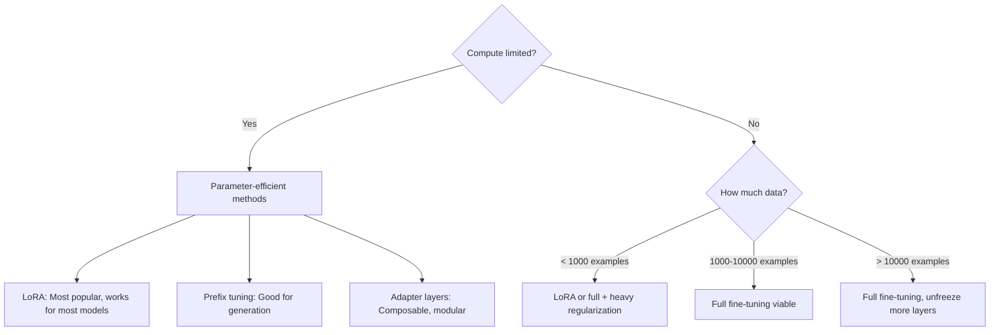

# Working with ML Models: From Hugging Face to Custom Training

## The New Reality of ML Development

A decade ago, training a model meant starting from random weights. Every project began at zero. The pioneers built architectures, collected datasets, trained for weeks, and hoped the loss would converge.

That world is gone.

Today, most ML practitioners never train a model from scratch. They download pre-trained weights, adapt them to their task, and deploy. The foundational work—learning representations from massive datasets—has been done by organizations with resources no individual or small team could match. Training GPT-5 reportedly cost hundreds of millions of dollars. Llama 3.1 405B was trained on 15 trillion tokens. DeepSeek R1's 671 billion parameters represent years of accumulated research. These are not numbers any individual can replicate.

This is not a weakness; it is leverage. Standing on the shoulders of giants is not just acceptable—it is the intelligent choice. The question is no longer "how do I train a model?" but rather "which model should I use, and how much should I adapt it?"

This post maps the decision landscape. We will explore the ecosystem of pre-trained models, understand the licenses that govern their use, learn the systematic approach to model selection and evaluation, and know when fine-tuning is necessary and when you must go deeper. By the end, you will have a framework for approaching any ML problem—from quick prototypes to production systems.

## The Hub Ecosystem: Where Models Live

### Hugging Face: The GitHub of ML

Hugging Face has become the central repository for machine learning models. As of late 2025, the Hub hosts over 1 million models across every major domain—NLP, vision, audio, multimodal, reinforcement learning. Understanding how to navigate it is a core skill.

Every model on the Hub has a **Model Card**—a structured document that should contain:

- **Model description**: What it does, how it was trained
- **Intended uses**: What tasks it is designed for
- **Limitations**: Known failure modes, biases
- **Training data**: What data shaped the model
- **Evaluation results**: Performance on standard benchmarks
- **License**: Legal terms for use

The quality of model cards varies dramatically. Models from major organizations (Meta, Google, Microsoft) typically have detailed cards. Community uploads may have minimal documentation. **Always read the model card before using a model in production.**

```python
from huggingface_hub import model_info

# Get model metadata programmatically
info = model_info("meta-llama/Llama-3.3-70B-Instruct")
print(f"Model: {info.modelId}")
print(f"Downloads: {info.downloads}")
print(f"License: {info.card_data.license}")
print(f"Tags: {info.tags}")
```

### Beyond Hugging Face

While Hugging Face dominates, other repositories exist:

| Repository | Focus | Notable For |
|------------|-------|-------------|
| Hugging Face Hub | General ML | Largest selection, transformers library |
| TorchHub | PyTorch models | Official PyTorch ecosystem models |
| TensorFlow Hub | TensorFlow models | TF ecosystem integration |
| ONNX Model Zoo | Cross-framework | Deployment-optimized models |
| Kaggle Models | Competition models | Practical, task-specific solutions |
| Papers with Code | Research models | Cutting-edge, reproducibility focus |
| Roboflow Universe | Computer vision | Object detection, segmentation |
| Civitai | Image generation | Stable Diffusion community models |

### Navigating Model Variants

A single architecture often has many variants. Consider the Llama family:

- **Llama-3.2-1B**: 1B parameters, edge/mobile deployment
- **Llama-3.2-3B**: 3B parameters, lightweight tasks
- **Llama-3.1-8B**: 8B parameters, versatile base model
- **Llama-3.1-70B**: 70B parameters, high-capability tasks
- **Llama-3.1-405B**: 405B parameters, frontier performance
- **Llama-3.3-70B-Instruct**: Latest instruction-tuned 70B

And that is just the official variants. Community fine-tuned versions (including Llama derivatives, merges, and quantized versions) number in tens of thousands.

Key dimensions when choosing variants:

| Dimension | Trade-off |
|-----------|-----------|
| Size (base/large) | Accuracy vs speed/memory |
| Cased vs uncased | Case sensitivity vs vocabulary size |
| Language | Mono vs multilingual (multilingual often worse per-language) |
| Domain | General vs domain-specific (legal, medical, code) |
| Distilled | Speed vs slight accuracy loss |
| Quantized | Memory/speed vs precision |

## Understanding Licenses: What You Can and Cannot Do

Licenses determine whether you can use a model for your purpose. Ignoring them is not just unethical—it is legal risk.

### The License Spectrum

| License | Commercial Use | Modification | Distribution | Notable Restrictions |
|---------|---------------|--------------|--------------|---------------------|
| MIT | Yes | Yes | Yes | None |
| Apache 2.0 | Yes | Yes | Yes | Patent grant required |
| BSD | Yes | Yes | Yes | Attribution required |
| CC-BY-4.0 | Yes | Yes | Yes | Attribution required |
| CC-BY-NC-4.0 | No | Yes | Yes | Non-commercial only |
| CC-BY-NC-SA-4.0 | No | Yes | Share alike | Non-commercial, derivatives same license |
| OpenRAIL | Varies | Yes | Yes | Use restrictions in license |
| Llama 3.1/3.2/3.3 | Yes | Yes | Yes | Attribution, acceptable use policy |
| Gemma | Yes | Yes | Yes | Google's open model license |
| Qwen | Yes | Yes | Yes | Alibaba open license |
| DeepSeek | Yes | Yes | Yes | MIT-style, very permissive |
| GPT/Claude/Gemini API | No | No | No | API use only, proprietary |

### OpenRAIL: The New Standard

Many recent models use OpenRAIL (Open Responsible AI License). It is permissive but includes **use restrictions**—prohibitions on harmful applications like generating misinformation, surveillance, or weapons development.

```
OpenRAIL-M (Model license) typically allows:
✓ Commercial use
✓ Modification and fine-tuning
✓ Distribution of derivatives

But prohibits:
✗ Generating content to deceive
✗ Surveillance applications  
✗ Discriminatory applications
✗ Medical advice without disclaimers
```

Read the specific license. OpenRAIL variants differ in their restrictions.

### Practical License Decisions

**Scenario 1: Building an internal tool for your company**
- Most open licenses work (MIT, Apache, OpenRAIL)
- CC-BY-NC might apply if not generating revenue directly
- Check specific terms for enterprise restrictions

**Scenario 2: Building a commercial product**
- Avoid CC-BY-NC licenses
- Llama 3.x removed the 700M MAU limit—check current terms
- Consider indemnification—who is liable if the model fails?

**Scenario 3: Building an API that serves model outputs**
- You are distributing derivatives
- Some licenses require sharing your fine-tuned weights
- Check redistribution terms carefully

**Scenario 4: Using for research and publication**
- Most licenses are permissive for research
- Check if commercial lab restrictions apply
- Cite appropriately

```python
# Quick license check
from huggingface_hub import model_info

def check_commercial_use(model_id: str) -> dict:
    info = model_info(model_id)
    license_name = getattr(info.card_data, 'license', 'unknown')
    
    non_commercial = ['cc-by-nc', 'gpl', 'research-only']
    commercial_friendly = ['mit', 'apache', 'bsd', 'cc-by-4.0', 'openrail']
    
    license_lower = license_name.lower()
    
    return {
        'model': model_id,
        'license': license_name,
        'likely_commercial': any(c in license_lower for c in commercial_friendly),
        'likely_non_commercial': any(nc in license_lower for nc in non_commercial),
        'recommendation': 'Read full license terms before production use'
    }
```

## The Taxonomy of Solutions

Before diving into specific models, understand the hierarchy of approaches:

### Level 0: API-Based Solutions

Use someone else's model via API.

**When to use:**
- Prototyping and validation
- Low volume, high value use cases
- State-of-the-art capability matters more than cost
- You lack ML infrastructure

**Examples:** OpenAI GPT-4o/o3, Anthropic Claude 3.5/4, Google Gemini 2.0, DeepSeek API

**Trade-offs:**
| Pros | Cons |
|------|------|
| No infrastructure needed | Per-call costs add up |
| Always latest models | Data leaves your control |
| Handles scale automatically | Latency from network calls |
| No ML expertise required | Rate limits and quotas |

```python
# API-based approach (OpenAI example)
from openai import OpenAI

client = OpenAI()
response = client.chat.completions.create(
    model="gpt-4o",  # or "o3-mini" for reasoning tasks
    messages=[{"role": "user", "content": "Classify this review..."}]
)
```

### Level 1: Pre-trained Models, Zero-Shot

Use a model directly without any training.

**When to use:**
- Task aligns with model's training objective
- You have no labeled data
- Testing feasibility before investing in fine-tuning

**Examples:** Zero-shot classification, text generation, image captioning

```python
from transformers import pipeline

# Zero-shot classification
classifier = pipeline("zero-shot-classification")
result = classifier(
    "This movie was absolutely fantastic!",
    candidate_labels=["positive", "negative", "neutral"]
)
# No training needed - model generalizes
```

### Level 2: Pre-trained Models, Few-Shot

Provide examples in the prompt or context.

**When to use:**
- Zero-shot performance is insufficient
- You have limited labeled examples
- Task requires specific formatting

```python
# Few-shot prompting
prompt = """
Classify the sentiment of movie reviews.

Review: "The acting was wooden and the plot predictable."
Sentiment: negative

Review: "A masterpiece of modern cinema."
Sentiment: positive

Review: "It was okay, nothing special."
Sentiment: neutral

Review: "I couldn't stop laughing, best comedy this year!"
Sentiment:"""

# The model learns the pattern from examples
```

### Level 3: Fine-tuning

Update model weights on your data.

**When to use:**
- Task-specific performance is critical
- You have substantial labeled data (hundreds to thousands of examples)
- You need consistent behavior
- Cost/latency of larger models is prohibitive

**Types of fine-tuning:**

| Technique | What Changes | When to Use |
|-----------|--------------|-------------|
| Full fine-tuning | All weights | Maximum adaptation, enough data |
| LoRA/QLoRA | Low-rank adapters | Limited compute, quick iteration |
| DoRA | Decomposed LoRA | Better than LoRA, similar cost |
| Prefix tuning | Prepended embeddings | Task-specific steering |
| Prompt tuning | Soft prompts | Minimal changes, multi-task |
| Adapter layers | Inserted modules | Modular, composable |

### Level 4: Training from Scratch

Initialize random weights and train entirely on your data.

**When to use:**
- Unique domain with no relevant pre-trained models
- Proprietary data that cannot inform pre-training
- Novel architecture for specific problem
- Extreme efficiency requirements

**Reality check:** This is rarely the right choice. Even specialized domains often benefit from pre-trained representations.

## The Expert's Decision Framework

An experienced ML practitioner does not start at the bottom and work up. They start at the top—with the simplest possible solution—and only add complexity when necessary.

### Phase 1: Establish Baselines

Before any model, establish baselines:

```python
# For classification
from sklearn.dummy import DummyClassifier
from sklearn.feature_extraction.text import TfidfVectorizer
from sklearn.linear_model import LogisticRegression
from sklearn.pipeline import Pipeline

# Baseline 1: Random/majority class
dummy = DummyClassifier(strategy='most_frequent')
dummy.fit(X_train, y_train)
print(f"Majority class accuracy: {dummy.score(X_test, y_test):.3f}")

# Baseline 2: Simple classical ML
tfidf_lr = Pipeline([
    ('tfidf', TfidfVectorizer(max_features=10000)),
    ('clf', LogisticRegression(max_iter=1000))
])
tfidf_lr.fit(X_train, y_train)
print(f"TF-IDF + LR accuracy: {tfidf_lr.score(X_test, y_test):.3f}")
```

Why baselines matter:
- They reveal problem difficulty
- They show how much value ML adds
- They catch data leakage (if dummy is too good, something is wrong)
- They provide a target to beat

### Phase 2: Try Existing Models

Start with established models for your task type:

| Task | Go-To Models (2025) |
|------|---------------------|
| Text Classification | ModernBERT, DeBERTa-v3, RoBERTa |
| Named Entity Recognition | GLiNER, SpaCy transformers, NuNER |
| Text Generation | Llama 3.3, Qwen 2.5, Mistral Large, DeepSeek R1 |
| Code Generation | DeepSeek Coder V2, Qwen2.5-Coder, CodeLlama |
| Image Classification | ViT, EfficientNetV2, ConvNeXt V2 |
| Object Detection | YOLOv11, RT-DETR, DINO |
| Semantic Segmentation | Segment Anything 2, SegFormer, Mask2Former |
| Image Generation | Stable Diffusion 3, FLUX, DALL-E 3 |
| Speech Recognition | Whisper Large V3, Canary |
| Embeddings (text) | GTE-Qwen2, BGE-M3, E5-Mistral |
| Embeddings (images) | SigLIP, DINOv2, CLIP ViT-L |
| Multimodal | Llama 3.2 Vision, Qwen2-VL, Gemini 2.0 Flash |

```python
from transformers import pipeline
from sentence_transformers import SentenceTransformer

# Try different models systematically
models_to_try = [
    "distilbert-base-uncased-finetuned-sst-2-english",
    "cardiffnlp/twitter-roberta-base-sentiment-latest",
    "nlptown/bert-base-multilingual-uncased-sentiment"
]

results = {}
for model_name in models_to_try:
    classifier = pipeline("sentiment-analysis", model=model_name)
    predictions = [classifier(text)[0]['label'] for text in X_test]
    accuracy = sum(p == t for p, t in zip(predictions, y_test)) / len(y_test)
    results[model_name] = accuracy
    
for model, acc in sorted(results.items(), key=lambda x: -x[1]):
    print(f"{model}: {acc:.3f}")
```

### Phase 3: Systematic Evaluation

Do not just look at accuracy. Evaluate comprehensively:

```python
from sklearn.metrics import classification_report, confusion_matrix
import pandas as pd

def comprehensive_evaluation(y_true, y_pred, class_names=None):
    """Full evaluation suite for classification."""
    
    # Per-class metrics
    report = classification_report(y_true, y_pred, target_names=class_names, output_dict=True)
    df_report = pd.DataFrame(report).transpose()
    
    # Confusion matrix
    cm = confusion_matrix(y_true, y_pred)
    
    # Error analysis
    errors = [(true, pred) for true, pred in zip(y_true, y_pred) if true != pred]
    error_distribution = pd.Series(errors).value_counts()
    
    return {
        'classification_report': df_report,
        'confusion_matrix': cm,
        'error_distribution': error_distribution,
        'accuracy': report['accuracy'],
        'macro_f1': report['macro avg']['f1-score'],
        'weighted_f1': report['weighted avg']['f1-score']
    }
```

Key evaluation dimensions:

| Dimension | Why It Matters |
|-----------|---------------|
| Accuracy | Overall correctness |
| Precision/Recall per class | Class imbalance effects |
| F1 Score | Harmonic mean, robust to imbalance |
| Confusion Matrix | Where errors happen |
| Latency | Production feasibility |
| Memory | Deployment constraints |
| Calibration | Confidence reliability |

### Phase 4: Error Analysis

Look at what the model gets wrong:

```python
def error_analysis(X_test, y_true, y_pred, n_samples=20):
    """Analyze model errors to understand failure modes."""
    
    errors = []
    for x, true, pred in zip(X_test, y_true, y_pred):
        if true != pred:
            errors.append({
                'input': x,
                'true_label': true,
                'predicted': pred
            })
    
    print(f"Total errors: {len(errors)} / {len(y_true)} ({100*len(errors)/len(y_true):.1f}%)")
    print("\nSample errors:")
    for err in errors[:n_samples]:
        print(f"\nInput: {err['input'][:100]}...")
        print(f"True: {err['true_label']} | Predicted: {err['predicted']}")
```

Error analysis reveals:
- **Systematic errors**: Consistent misclassification patterns
- **Boundary cases**: Inputs at decision boundaries
- **Data issues**: Label errors, ambiguous examples
- **Distribution shift**: Test data differs from training assumptions

### Phase 5: Decision Point—Fine-tune or Not?

After thorough evaluation of existing models, decide:

**Stay with pre-trained if:**
- Accuracy meets requirements
- Errors are acceptable (random, not systematic)
- No labeled data available
- Time/budget constraints

**Fine-tune if:**
- Clear accuracy gap vs requirements
- Systematic errors that training data could fix
- Domain-specific vocabulary or patterns
- Consistency/reliability matters

## Fine-Tuning: When and How

### Preparing for Fine-Tuning

Fine-tuning is not magic. Success depends on:

1. **Quality labeled data** (hundreds to thousands of examples)
2. **Clear evaluation criteria** (what "good" looks like)
3. **Representative test set** (held out, never touched during development)
4. **Reasonable expectations** (fine-tuning adds 5-15% typically, not 50%)

### Data Requirements

| Task Type | Minimum Examples | Recommended | Notes |
|-----------|------------------|-------------|-------|
| Text Classification | 100 per class | 500+ per class | Balanced classes preferred |
| NER | 500 sentences | 2000+ sentences | Entity diversity matters |
| Text Generation | 1000 examples | 10000+ | Quality over quantity |
| Image Classification | 100 per class | 1000+ per class | Augmentation helps |
| Object Detection | 500 annotations | 5000+ | Variety of conditions |

### Choosing Fine-Tuning Strategy



### LoRA: The Practical Choice

Low-Rank Adaptation adds small trainable matrices to frozen model weights:

```python
from peft import LoraConfig, get_peft_model
from transformers import AutoModelForSequenceClassification

# Load base model
model = AutoModelForSequenceClassification.from_pretrained(
    "bert-base-uncased",
    num_labels=3
)

# Configure LoRA
lora_config = LoraConfig(
    r=16,  # Rank of adaptation matrices
    lora_alpha=32,  # Scaling factor
    target_modules=["query", "value"],  # Which layers to adapt
    lora_dropout=0.1,
    bias="none",
    task_type="SEQ_CLS"
)

# Apply LoRA
model = get_peft_model(model, lora_config)

# Check trainable parameters
trainable = sum(p.numel() for p in model.parameters() if p.requires_grad)
total = sum(p.numel() for p in model.parameters())
print(f"Trainable: {trainable:,} / {total:,} ({100*trainable/total:.2f}%)")
# Output: Trainable: 294,912 / 109,483,778 (0.27%)
```

LoRA advantages:
- Trains in minutes instead of hours
- Stores tiny adapter weights (MBs instead of GBs)
- Multiple adapters can share one base model
- Lower overfitting risk

### Full Fine-Tuning

When you have enough data and compute:

```python
from transformers import (
    AutoModelForSequenceClassification,
    Trainer,
    TrainingArguments
)

model = AutoModelForSequenceClassification.from_pretrained(
    "bert-base-uncased",
    num_labels=3
)

training_args = TrainingArguments(
    output_dir="./results",
    num_train_epochs=3,
    per_device_train_batch_size=16,
    per_device_eval_batch_size=64,
    warmup_steps=500,
    weight_decay=0.01,
    logging_dir="./logs",
    logging_steps=10,
    evaluation_strategy="epoch",
    save_strategy="epoch",
    load_best_model_at_end=True,
    metric_for_best_model="f1",
)

trainer = Trainer(
    model=model,
    args=training_args,
    train_dataset=train_dataset,
    eval_dataset=eval_dataset,
    compute_metrics=compute_metrics,
)

trainer.train()
```

### Fine-Tuning Best Practices

| Practice | Why |
|----------|-----|
| Start with lower learning rate (2e-5 to 5e-5) | Pre-trained weights are good, don't destroy them |
| Use warmup | Stabilize early training |
| Monitor validation loss | Catch overfitting early |
| Save checkpoints | Resume if training fails |
| Freeze layers initially | Fewer parameters to tune |
| Gradually unfreeze | Add capacity if needed |
| Early stopping | Prevent overfitting |

## When Fine-Tuning Is Not Enough

Sometimes fine-tuning hits a wall. Signs that you need to go deeper:

1. **Performance plateaus** despite more data or longer training
2. **Systematic failures** that fine-tuning does not fix
3. **Domain mismatch** too large (e.g., legal text with general model)
4. **Architecture limitations** (model cannot handle your input format)

### Options When Fine-Tuning Fails

**Option 1: Try a Different Base Model**

Often the first base model was not optimal:

```python
# Systematic base model search
base_models = [
    "answerdotai/ModernBERT-base",  # 2024 BERT replacement
    "microsoft/deberta-v3-base",
    "google/gemma-2-2b",
    "Qwen/Qwen2.5-1.5B",
    "meta-llama/Llama-3.2-3B",  # For longer contexts
]

for base_model in base_models:
    model = fine_tune(base_model, train_data)
    score = evaluate(model, test_data)
    print(f"{base_model}: {score:.3f}")
```

**Option 2: Domain-Adaptive Pre-Training**

Continue pre-training on your domain before fine-tuning:

```python
from transformers import AutoModelForMaskedLM, DataCollatorForLanguageModeling

# Step 1: Continue pre-training on domain text (unlabeled)
model = AutoModelForMaskedLM.from_pretrained("bert-base-uncased")

# Train on domain-specific text with MLM objective
# This adapts the representations to your domain

# Step 2: Then fine-tune on labeled data
model = AutoModelForSequenceClassification.from_pretrained("./domain-adapted-bert")
# Continue with normal fine-tuning
```

This is powerful when you have lots of domain text but limited labels.

**Option 3: Ensemble Methods**

Combine multiple models:

```python
class EnsembleClassifier:
    def __init__(self, models, weights=None):
        self.models = models
        self.weights = weights or [1/len(models)] * len(models)
    
    def predict(self, text):
        predictions = []
        for model in self.models:
            pred = model.predict(text)
            predictions.append(pred)
        
        # Weighted voting
        final = {}
        for pred, weight in zip(predictions, self.weights):
            for label, prob in pred.items():
                final[label] = final.get(label, 0) + prob * weight
        
        return max(final, key=final.get)
```

**Option 4: Architecture Modification**

Add task-specific components:

```python
import torch.nn as nn
from transformers import AutoModel

class CustomClassifier(nn.Module):
    def __init__(self, base_model_name, num_labels, dropout=0.3):
        super().__init__()
        self.base = AutoModel.from_pretrained(base_model_name)
        hidden_size = self.base.config.hidden_size
        
        # Custom classification head
        self.classifier = nn.Sequential(
            nn.Dropout(dropout),
            nn.Linear(hidden_size, hidden_size),
            nn.GELU(),
            nn.Dropout(dropout),
            nn.Linear(hidden_size, num_labels)
        )
        
        # Optional: freeze base initially
        for param in self.base.parameters():
            param.requires_grad = False
    
    def forward(self, input_ids, attention_mask):
        outputs = self.base(input_ids=input_ids, attention_mask=attention_mask)
        pooled = outputs.last_hidden_state[:, 0]  # [CLS] token
        return self.classifier(pooled)
```

## Training from Scratch: The Last Resort

Training from scratch is rarely the right choice, but sometimes it is the only choice.

### When It Makes Sense

1. **Novel modality**: No pre-trained models exist for your data type
2. **Extreme efficiency needs**: You need a tiny model for edge deployment
3. **Proprietary data advantage**: Your unique data could create competitive moat
4. **Novel architecture research**: You are exploring new ideas

### What You Need

| Requirement | Minimum | Recommended |
|-------------|---------|-------------|
| Training data | 10,000+ examples | 100,000+ for deep models |
| Compute | 1 GPU for days | Multi-GPU for weeks |
| Expertise | Strong ML fundamentals | Architecture design experience |
| Time | Weeks | Months for iteration |

### The From-Scratch Workflow

1. **Architecture selection**
   - Start with established architectures (ResNet, Transformer)
   - Modify only what's necessary

2. **Data pipeline**
   - Ensure data loading is not the bottleneck
   - Implement proper augmentation

3. **Training recipe**
   - Learning rate schedules (warmup + cosine decay)
   - Regularization (dropout, weight decay)
   - Gradient clipping

4. **Extensive experimentation**
   - Hyperparameter search
   - Architecture variations
   - Loss function experiments

5. **Rigorous evaluation**
   - Hold out true test set
   - Compare to baselines and existing models
   - Ablation studies

## The Toolbox: Essential Libraries

### Hugging Face Ecosystem

```python
# transformers: Core library for pre-trained models
from transformers import AutoModel, AutoTokenizer, pipeline

# datasets: Data loading and processing
from datasets import load_dataset, Dataset

# peft: Parameter-efficient fine-tuning
from peft import LoraConfig, get_peft_model

# evaluate: Metrics and evaluation
import evaluate

# accelerate: Multi-GPU and mixed precision
from accelerate import Accelerator

# huggingface_hub: Model sharing and versioning
from huggingface_hub import login, push_to_hub
```

### Computer Vision

```python
# timm: PyTorch Image Models - extensive model zoo
import timm
model = timm.create_model('convnextv2_base', pretrained=True, num_classes=10)

# torchvision: Official PyTorch vision
import torchvision.models as models
vit = models.vit_b_16(weights='IMAGENET1K_V1')

# ultralytics: YOLO object detection (YOLOv11 is latest as of 2025)
from ultralytics import YOLO
model = YOLO('yolo11n.pt')  # nano, small, medium, large, xlarge available
```

### Embeddings and Similarity

```python
# sentence-transformers: State-of-the-art embeddings
from sentence_transformers import SentenceTransformer

# Top embedding models as of 2025 (check MTEB leaderboard for latest)
model = SentenceTransformer('Alibaba-NLP/gte-Qwen2-1.5B-instruct')  # Excellent quality
# Alternatives: 'BAAI/bge-m3', 'intfloat/e5-mistral-7b-instruct'

embeddings = model.encode(["text1", "text2"])

# Compute similarity
from sentence_transformers.util import cos_sim
similarity = cos_sim(embeddings[0], embeddings[1])
```

### Deployment Optimization

```python
# ONNX export for cross-platform deployment
import torch.onnx

torch.onnx.export(
    model,
    dummy_input,
    "model.onnx",
    input_names=['input'],
    output_names=['output'],
    dynamic_axes={'input': {0: 'batch'}, 'output': {0: 'batch'}}
)

# Quantization for efficiency
from optimum.onnxruntime import ORTQuantizer
from optimum.onnxruntime.configuration import AutoQuantizationConfig

quantizer = ORTQuantizer.from_pretrained("model-directory")
qconfig = AutoQuantizationConfig.avx512_vnni(is_static=False)
quantizer.quantize(save_dir="quantized-model", quantization_config=qconfig)
```

## Model Versioning and Experiment Tracking

Every model iteration should be tracked:

```python
import mlflow
from datetime import datetime

mlflow.set_experiment("sentiment-classification")

with mlflow.start_run(run_name=f"bert-lora-{datetime.now().strftime('%Y%m%d-%H%M')}"):
    # Log parameters
    mlflow.log_params({
        "base_model": "bert-base-uncased",
        "fine_tuning": "lora",
        "lora_r": 16,
        "learning_rate": 2e-5,
        "epochs": 3,
        "train_size": len(train_dataset)
    })
    
    # Train
    trainer.train()
    
    # Log metrics
    results = trainer.evaluate()
    mlflow.log_metrics({
        "eval_accuracy": results["eval_accuracy"],
        "eval_f1": results["eval_f1"],
        "eval_loss": results["eval_loss"]
    })
    
    # Log model
    mlflow.transformers.log_model(
        trainer.model,
        "model",
        task="text-classification"
    )
```

## Quick Reference: Model Selection Checklist

Before choosing a model, answer these:

**Task Requirements:**
- [ ] What exactly should the model do?
- [ ] What accuracy is acceptable?
- [ ] What latency is acceptable?
- [ ] What is the expected throughput?

**Constraints:**
- [ ] What hardware is available?
- [ ] What is the memory budget?
- [ ] What license restrictions exist?
- [ ] What is the time budget?

**Data Situation:**
- [ ] How much labeled data exists?
- [ ] Is the data representative of production?
- [ ] Is there unlabeled domain data available?

**Evaluation Plan:**
- [ ] What metrics matter?
- [ ] Is there a held-out test set?
- [ ] How will production performance be monitored?

## The Path Forward

This post covered the complete spectrum of working with ML models—from downloading pre-trained weights to the decision of training from scratch. The key insights:

1. **Start simple**: APIs and zero-shot before fine-tuning before training
2. **Evaluate rigorously**: Baselines, comprehensive metrics, error analysis
3. **Understand licenses**: Legal compliance is not optional
4. **Fine-tune strategically**: LoRA often beats full fine-tuning
5. **Know when to stop**: Perfect is the enemy of deployed

The next posts will complement this foundation with deep dives into specific areas: feature engineering, cloud deployment, and the ML libraries that power it all. With the structure, Python skills, resource understanding, and model expertise from this series, you have the foundation to approach any ML problem systematically.

Now pick a problem and solve it.

---

## References

- [Hugging Face Documentation](https://huggingface.co/docs)
- [The Illustrated Transformer](https://jalammar.github.io/illustrated-transformer/) by Jay Alammar
- [Transfer Learning in NLP](https://ruder.io/transfer-learning/) by Sebastian Ruder
- [LoRA Paper](https://arxiv.org/abs/2106.09685) - Low-Rank Adaptation of Large Language Models
- [PEFT Documentation](https://huggingface.co/docs/peft) - Parameter-Efficient Fine-Tuning
- [Sentence Transformers](https://www.sbert.net/) - For embedding models
- [Papers with Code](https://paperswithcode.com/) - State-of-the-art model tracking

